# Dynamic Routing & Static Generation

**Bagian 1 – Membuat Dynamic Route**

1. Buka file pages/products/[product].tsx dan modfikasi sbb ( line 20 )

```tsx
<Link
  href={`/produk/${products.id}`}
  key={products.id}
  className={styles.produk__content__item}
>
  <div className={styles.produk__content__item__image}>
    
  </div>

  <h4 className={styles.produk__content__item__name}>{products.name}</h4>

  <p className={styles.produk__content__item__category}>{products.category}</p>

  <p className={styles.produk__content__item__price}>
    Rp {products.price.toLocaleString("id-ID")}
  </p>
</Link>
```

2. Jalankan browser http://localhost:3000/produk

- Jika kita klik salah satu gambar maka akan menuju halaman lain

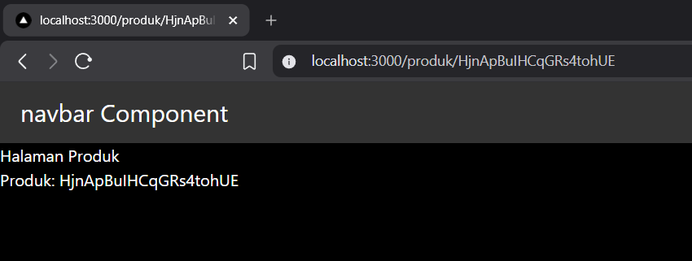

**Bagian 2 – Implementasi CSR (Client Rendering)**

1. Modifikasi pada file [produk].tsx pada folder src/pages/produk/

```tsx
const { query } = useRouter();
const { data, error, isLoading } = useSWR(
  `/api/products/${query.produk}`,
  fetcher,
);
```

2. Pada file produk.ts pada folder pages/api di rename menjadi [[...product]].ts

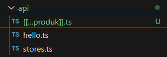

3. Modifikasi file servicefirebase.ts

```tsx
export async function retrieveProductById(collectionName: string, id: string) {
  const snapshot = await getDoc(doc(db, collectionName, id));
  const data = snapshot.data();
  return data;
}
```

4. Modifikasi file [[...produk]].ts

```tsx
// Next.js API route support: https://nextjs.org/docs/api-routes/introduction
import type { NextApiRequest, NextApiResponse } from "next";
import {
  retrieveProductById,
  retrieveProducts,
} from "../../utils/db/servicefirebase";

type Data = {
  status: boolean;
  status_code: number;
  data: any;
};

export default async function handler(
  req: NextApiRequest,
  res: NextApiResponse<Data>,
) {
  if (req.query.produk![1]) {
    const data = await retrieveProductById("products", req.query.produk![1]);
    res.status(200).json({ status: true, status_code: 200, data });
    return;
  } else {
    const data = await retrieveProducts("products");
    res.status(200).json({ status: true, status_code: 200, data });
  }
}
```

5. Jalankan browser http://localhost:3000/api/produk/HjnApBuIHCqGRs4tohUE

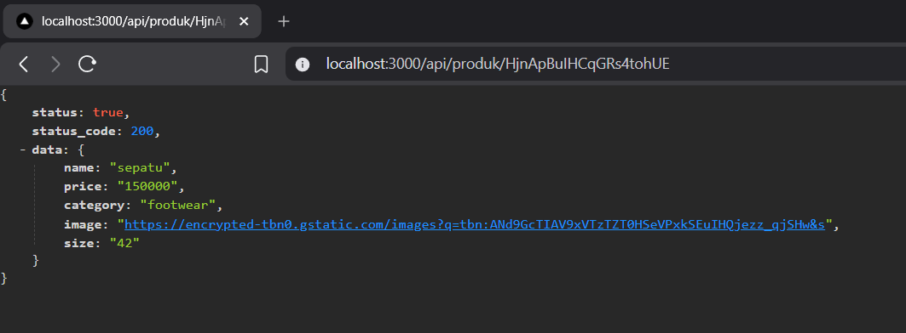

6. Jalankan alamat url http://localhost:3000/api/produk/123

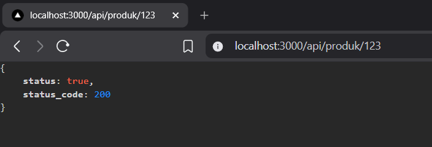

7. Buat file dengan nama index.tsx pada folder views/DetailProduct selain itu buat juga file dengan nama detailProduct.module.scss


8. Modifikasi detailProduct.module.scss

```scss
.produkdetail {
  margin: 40px auto;
  padding: 24px;
  display: flex;
  gap: 40px;
  background-color: #ffffff;
  border-radius: 12px;
  box-shadow: 0 10px 25px rgba(0, 0, 0, 0.08);
  align-items: flex-start;

  &__image {
    flex: 1;

    img {
      width: 100%;
      border-radius: 12px;
      object-fit: cover;
    }
  }

  &__info {
    flex: 1.2;
    display: flex;
    flex-direction: column;
  }

  &__name {
    font-size: 28px;
    font-weight: 700;
    margin-bottom: 12px;
    color: #222;
  }

  &__category {
    font-size: 16px;
    color: #666;
    margin-bottom: 16px;
  }

  &__price {
    font-size: 22px;
    font-weight: bold;
    color: #ff5722;
    margin-bottom: 20px;
  }

  &__button {
    width: fit-content;
    padding: 12px 24px;
    background-color: #111;
    color: white;
    border-radius: 8px;
    cursor: pointer;
    transition: 0.3s ease;

    &:hover {
      background-color: #ff5722;
    }
  }
}

/* Responsive */
@media (max-width: 768px) {
  .produkdetail {
    flex-direction: column;

    &__image {
      margin-bottom: 20px;
    }
  }
}
```

9. Modifikasi index.tsx pada folder DetailProduct

```tsx
import { ProductType } from "../../types/Produk.type";
import styles from "../DetailProduct/detailProduct.module.scss";

const DetailProduk = ({ products }: { products: ProductType }) => {
  return (
    <div className={styles.produkdetail}>
      <div className={styles.produkdetail__image}>
        
      </div>

      <div className={styles.produkdetail__info}>
        <h1 className={styles.produkdetail__name}>{products.name}</h1>
        <p className={styles.produkdetail__category}>{products.category}</p>
        <p className={styles.produkdetail__price}>
          Rp {products.price.toLocaleString("id-ID")}
        </p>
      </div>
    </div>
  );
};

export default DetailProduk;
```

10. Modifikasi file [product].tsx

```tsx
import fetcher from "@/utils/swr/fetcher";
import { useRouter } from "next/router";
import useSWR from "swr";
import DetailProduk from "../../views/DetailProduct";

const HalamanProduk = () => {
  // const Router = useRouter();
  // console.log(Router);
  const { query } = useRouter();
  const { data, error, isLoading } = useSWR(
    `/api/products/${query.produk}`,
    fetcher,
  );
  return (
    <div>
      <DetailProduk products={isLoading ? [] : data.data} />
    </div>
  );
};

export default HalamanProduk;
```

11. Modifikasi index.tsx pada folder views/detailProduct line 16

```tsx
        <div className={styles.produkdetail__info}>
          <h1 className={styles.produkdetail__name}>{products.name}</h1>
          <p className={styles.produkdetail__category}>{products.category}</p>
          <p className={styles.produkdetail__price}>
            Rp {products.price && products.price.toLocaleString("id-ID")}
          </p>
```

12. Jalankan browser http://localhost:3000/produk/ saat produk diklik maka akan muncul detailProduk http://localhost:3000/produk/pAWIT99SWmVbVrNm49ml

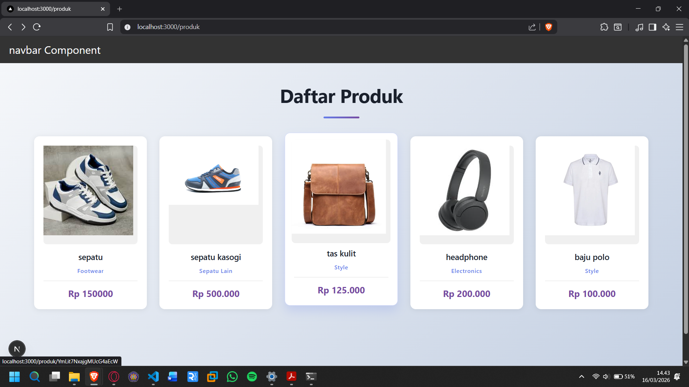

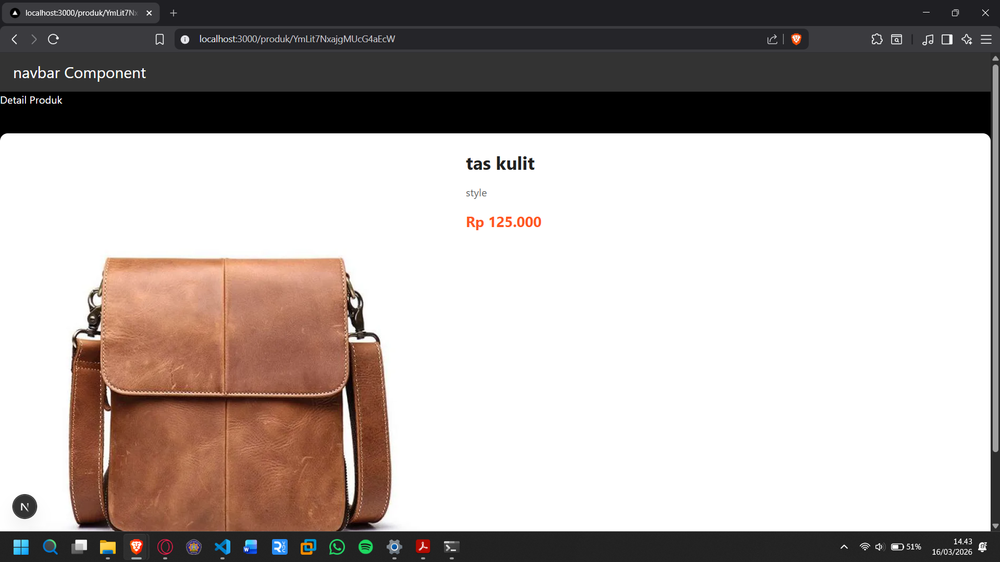

13. Agar tulisan detail produk ditengah maka modifikasi file detailProduct.module.scss line 103-108

```scss
.title {
  text-align: center;
  font-size: 32px;
  font-weight: bold;
  margin-bottom: 40px;
  color: #333;
}
```

dan file index.tsx tambahkan code pada line 7,8 dan 22 menjadi

```tsx
<h1 className={styles.title}>Detail Produk</h1>
```

14. Sehingga hasilnya seperti berikut

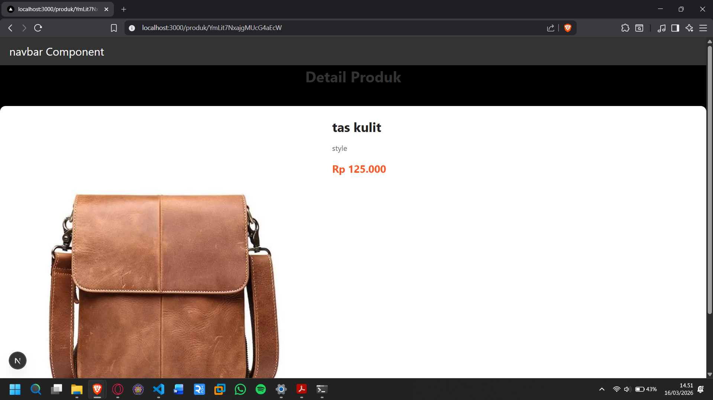

**Bagian 3 – Implementasi SSR**

1. Modifikasi [produk].tsx pada folder src/pages/produk dan comment line 9 sampai 20 dikarena kita akan menggunakan metode SSR. Tambahkan beberapa kode untuk SSR

```tsx
export async function getServerSideProps({
  params,
}: {
  params: { produk: string };
}) {
  const res = await fetch(`http://localhost:3000/api/produk/${params?.produk}`);
  const respone = await res.json();
  // console.log("Data produk yang diambil dari API:", respone);
  return {
    props: {
      product: respone.data, // Pastikan untuk memberikan nilai default jika data tidak tersedia
    },
  };
}
```

2. Jalankan browser http://localhost:3000/produk/server
   Tidak perlu loading state karena data sudah tersedia sebelum render.

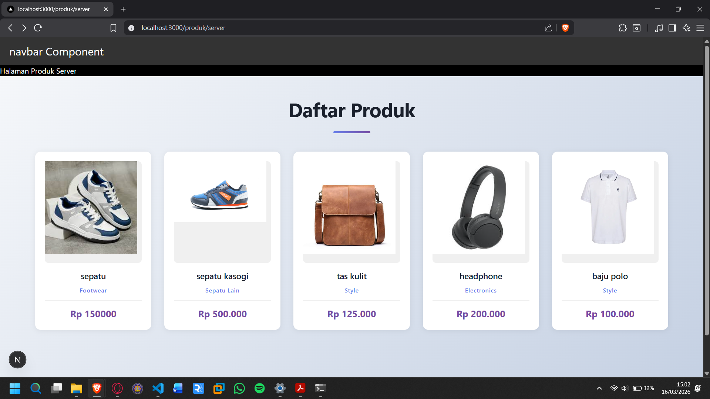

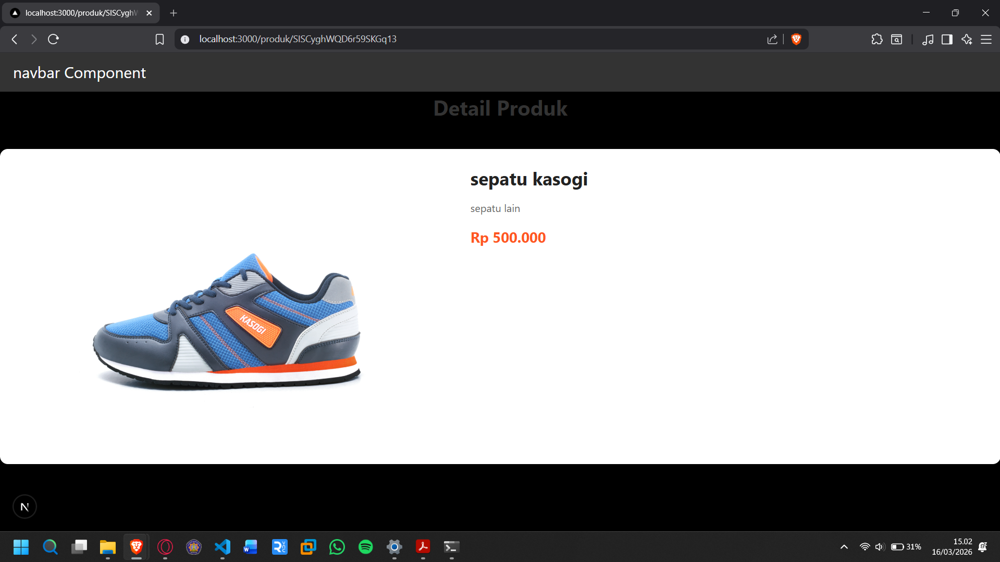

**Bagian 4 – Implementasi Static Site Generation (Dynamic SSG)**

1. Buka file [produk].tsx dan modifikasi seperti berikut

```tsx
{
  /*digunakan static-site generation*/
}
export async function getStaticPaths() {
  const res = await fetch("http://localhost:3000/api/products");
  const response = await res.json();

  const paths = response.data.map((product: ProductType) => ({
    params: { produk: product.id },
  }));
  // console.log("Paths yang dihasilkan untuk produk:", paths); // Debugging: Tampilkan paths yang dihasilkan
  return {
    paths,
    fallback: false,
  };
}

export async function getStaticProps({
  params,
}: {
  params: { produk: string };
}) {
  const res = await fetch(`http://localhost:3000/api/produk/${params?.produk}`);
  // const response: ProductType[] = await res.json();
  const response: { data: ProductType[] } = await res.json();

  // console.log("Data produk yang diambil dari API:", response);
  return {
    props: {
      product: response.data,
    },
  };
}
```

2. Buka file index.tsx pada folder src/views/DetailProduct dan modifikasi pada line 11

```tsx

```

3. Jalankan browser http://localhost:3000/produk

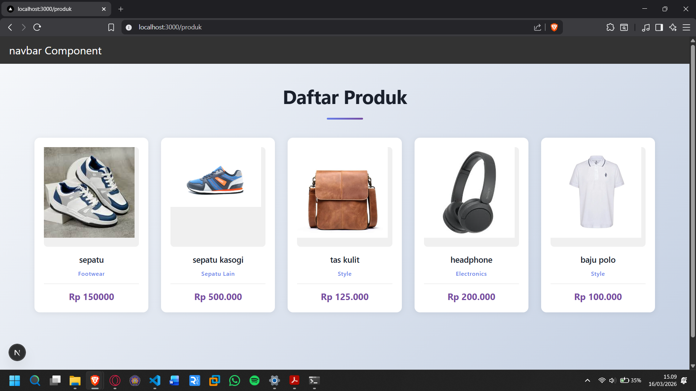

Saat diklik salah satu produk


**Pengujian**

Uji 1 – CSR

- Refresh halaman detail
- Perhatikan loading
- Periksa Network → XHR → API request terlihat

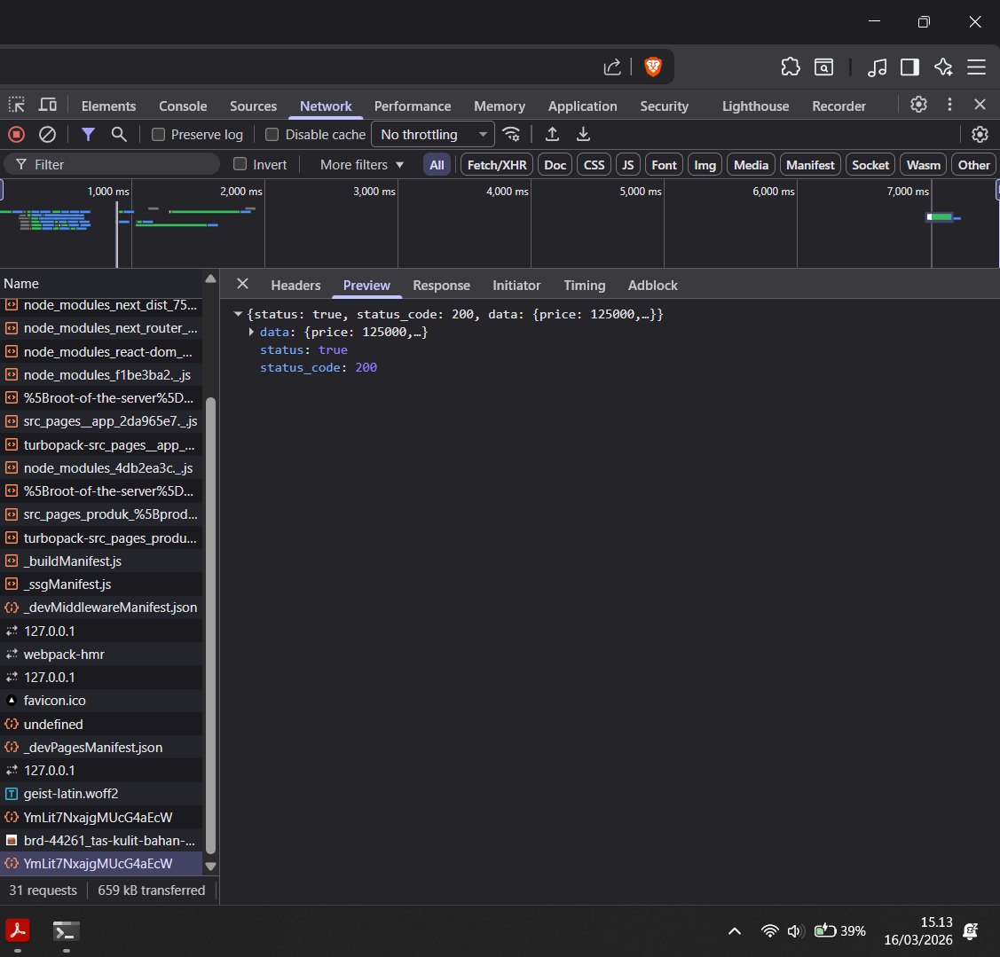

Uji 2 – SSR

- Refresh halaman detail
- Tidak ada loading
- Periksa Network → tidak terlihat fetch detail

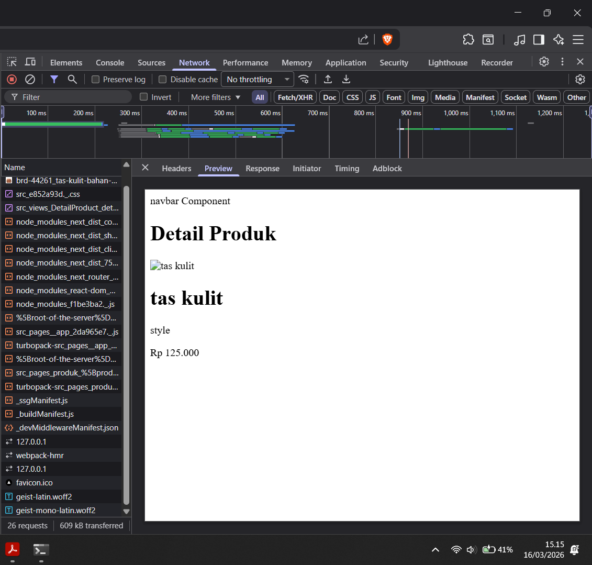

Hanya terlihat fetch HTML dan resource seperti images yang digunakan pada page

Uji 3 – SSG ( Lakukan seperti langkah sebelumya pada Jobsheet 10)

1. Jalankan:
   - npm run build
   - npm run start

   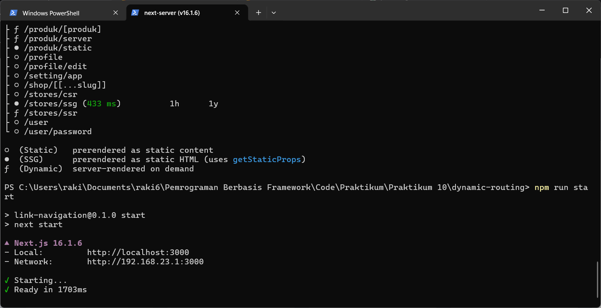

2. Tambahkan produk baru di database.

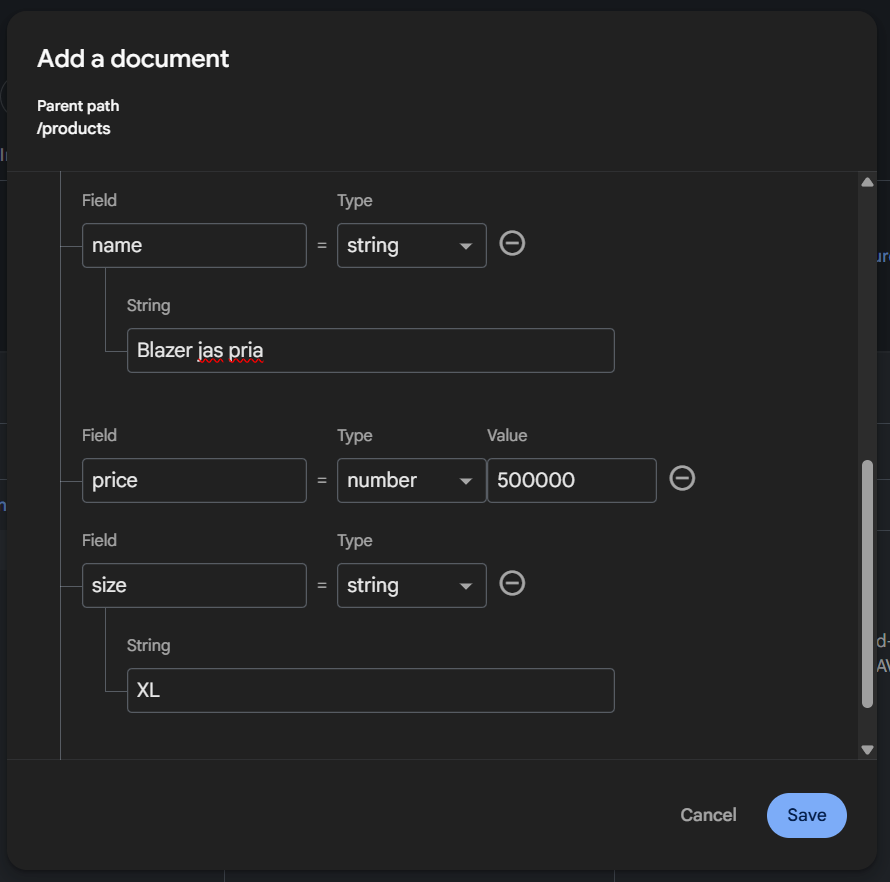

3. Buka halaman detail produk baru:

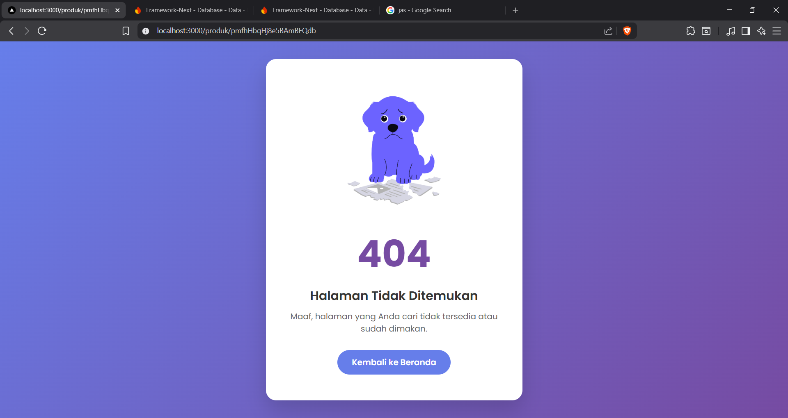

4. Build ulang:

- npm run build
- npm run start

  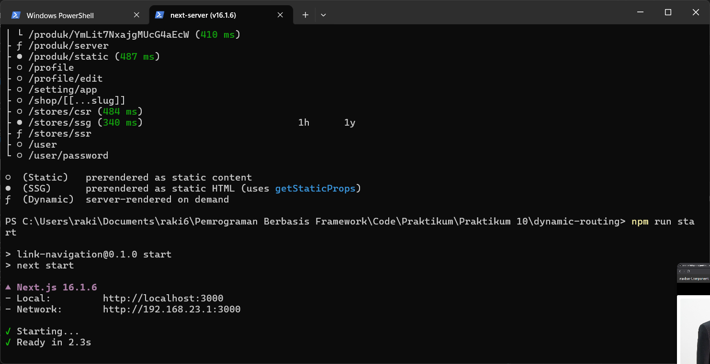

  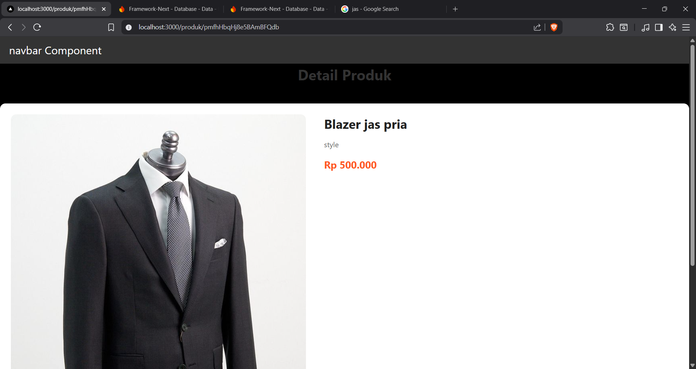

**Tugas Individu**

1. Implementasikan halaman detail dengan:

- CSR

```tsx
import { useRouter } from "next/router";
import useSWR from "swr";
import DetailProduk from "@/views/DetailProduct";
import { ProductType } from "@/types/Produk.type";

const fetcher = (url: string) => fetch(url).then((res) => res.json());

const HalamanProdukCSR = () => {
  const router = useRouter();
  const { produk } = router.query;

  const { data, error, isLoading } = useSWR(
    produk ? `/api/produk/${produk}` : null,
    fetcher,
  );

  if (isLoading) {
    return (
      <div style={{ padding: "2rem", textAlign: "center" }}>
        <h2>Loading...</h2>
      </div>
    );
  }

  if (error) {
    return (
      <div style={{ padding: "2rem", textAlign: "center" }}>
        <h2>Error loading product</h2>
      </div>
    );
  }

  if (!data || !data.data) {
    return (
      <div style={{ padding: "2rem", textAlign: "center" }}>
        <h2>Product not found</h2>
      </div>
    );
  }

  return (
    <div style={{ padding: "2rem" }}>
      <div style={{ marginBottom: "1.5rem" }}>
        <p style={{ fontSize: "0.9rem", color: "#666" }}>
          <strong>Rendering Mode:</strong> Client-Side Rendering (CSR)
        </p>
      </div>
      <DetailProduk products={data.data} />
    </div>
  );
};

export default HalamanProdukCSR;
```

- SSR

```tsx
import DetailProduk from "@/views/DetailProduct";
import { ProductType } from "@/types/Produk.type";

interface HalamanProdukSSRProps {
  product: ProductType;
}

const HalamanProdukSSR = ({ product }: HalamanProdukSSRProps) => {
  return (
    <div style={{ padding: "2rem" }}>
      <div style={{ marginBottom: "1.5rem" }}>
        <p style={{ fontSize: "0.9rem", color: "#666" }}>
          <strong>Rendering Mode:</strong> Server-Side Rendering (SSR)
        </p>
      </div>
      <DetailProduk products={product} />
    </div>
  );
};

export default HalamanProdukSSR;

// Fungsi getServerSideProps akan dipanggil setiap kali halaman ini diakses,
// dan akan mengambil data produk dari API sebelum merender halaman.
export async function getServerSideProps({
  params,
}: {
  params: { produk: string };
}) {
  try {
    const res = await fetch(
      `http://localhost:3000/api/produk/${params.produk}`,
    );
    const response = await res.json();

    if (!response.data) {
      return {
        notFound: true,
      };
    }

    return {
      props: {
        product: response.data,
      },
    };
  } catch (error) {
    return {
      notFound: true,
    };
  }
}
```

- SSG

```tsx
import DetailProduk from "@/views/DetailProduct";
import { ProductType } from "@/types/Produk.type";

interface HalamanProdukSSGProps {
  product: ProductType;
}

const HalamanProdukSSG = ({ product }: HalamanProdukSSGProps) => {
  return (
    <div style={{ padding: "2rem" }}>
      <div style={{ marginBottom: "1.5rem" }}>
        <p style={{ fontSize: "0.9rem", color: "#666" }}>
          <strong>Rendering Mode:</strong> Static-Site Generation (SSG)
        </p>
      </div>
      <DetailProduk products={product} />
    </div>
  );
};

export default HalamanProdukSSG;

// Fungsi getStaticPaths menghasilkan daftar path yang akan di-generate pada saat build
export async function getStaticPaths() {
  try {
    const res = await fetch("http://localhost:3000/api/products");
    const response = await res.json();

    const paths = response.data.map((product: ProductType) => ({
      params: { produk: product.id },
    }));

    return {
      paths,
      fallback: "blocking", // Jika path tidak ada, Next.js akan generate di saat request
    };
  } catch (error) {
    console.error("Error fetching products for SSG:", error);
    return {
      paths: [],
      fallback: "blocking",
    };
  }
}

// Fungsi getStaticProps akan dipanggil pada saat build dan generate halaman statis
export async function getStaticProps({
  params,
}: {
  params: { produk: string };
}) {
  try {
    const res = await fetch(
      `http://localhost:3000/api/produk/${params.produk}`,
    );
    const response = await res.json();

    if (!response.data) {
      return {
        notFound: true,
      };
    }

    return {
      props: {
        product: response.data,
      },
      revalidate: 60, // Revalidate setiap 60 detik (ISR)
    };
  } catch (error) {
    return {
      notFound: true,
    };
  }
}
```

2. Buat tabel perbandingan:

| Aspek          | CSR (Client Side Rendering)                              | SSR (Server Side Rendering)                           | SSG (Static Site Generation)                                   |
| -------------- | -------------------------------------------------------- | ----------------------------------------------------- | -------------------------------------------------------------- |
| Loading        | Loading awal lebih lambat karena data diambil di browser | Lebih cepat karena HTML sudah dirender di server      | Sangat cepat karena halaman sudah berupa file statis           |
| Build Required | Tidak perlu build khusus untuk data                      | Tidak perlu build ulang untuk perubahan data          | Perlu build ulang jika data berubah                            |
| SEO            | Kurang optimal jika tidak dikonfigurasi dengan baik      | Sangat baik untuk SEO karena konten sudah ada di HTML | Sangat baik karena halaman statis mudah diindeks mesin pencari |
| Perubahan Data | Data bisa berubah secara real-time di sisi client        | Data diperbarui setiap request ke server              | Data tidak berubah sampai dilakukan build ulang                |

3. Dokumentasikan:

- Screenshot
  - CSR

  http://localhost:3000/produk/csr/pmfhHbqHj8e5BAmBFQdb

  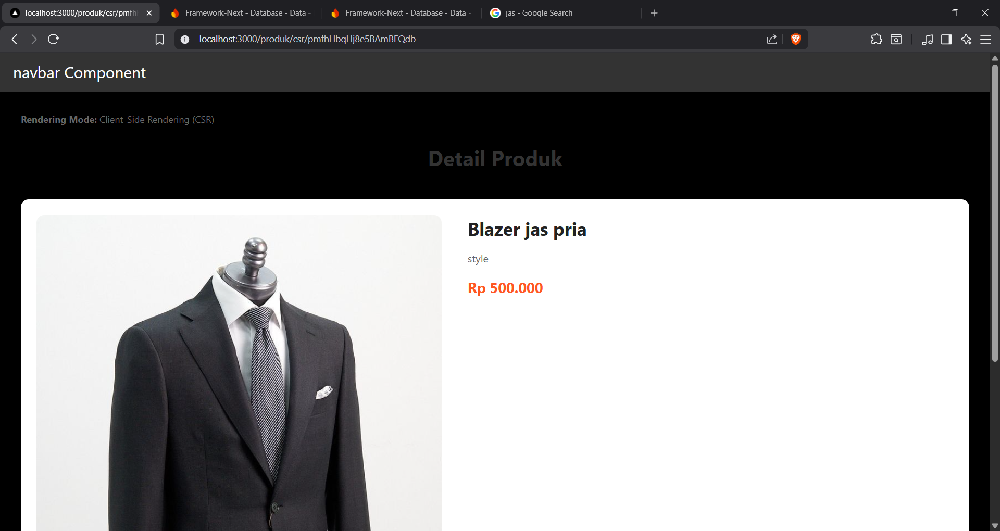
  - SSR

  http://localhost:3000/produk/ssr/pmfhHbqHj8e5BAmBFQdb

  
  - SSG

  http://localhost:3000/produk/ssg/pmfhHbqHj8e5BAmBFQdb

  

- Network tab
  - CSR

    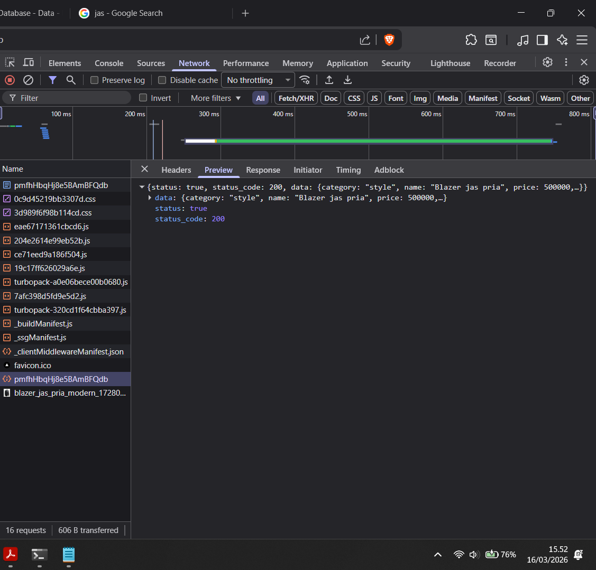

  - SSR

    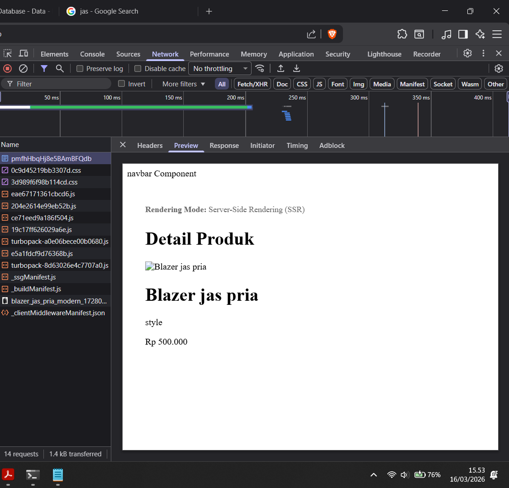

  - SSG

    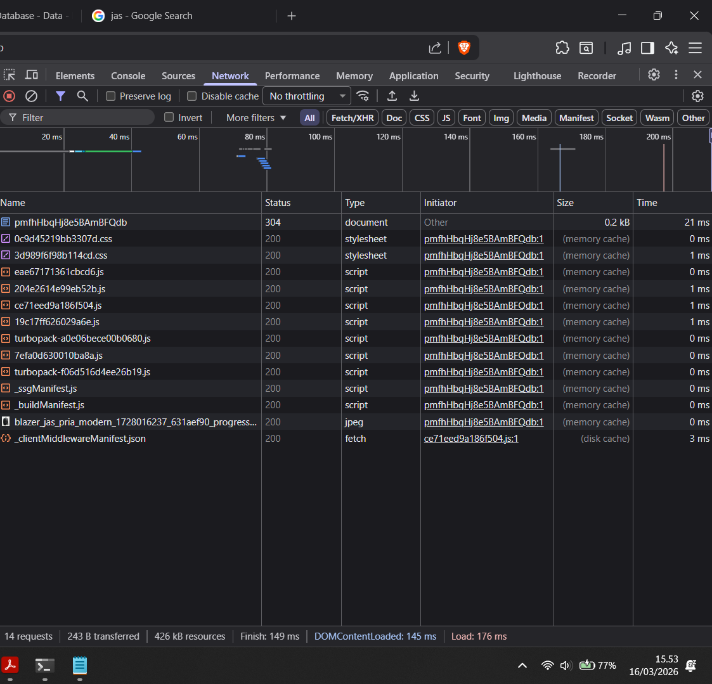

- Build result

  ```shell
  Route (pages)                                  Revalidate  Expire
  ┌ ○ / (595 ms)
  ├   /_app
  ├ ○ /404
  ├ ○ /about
  ├ ƒ /api/[[...produk]]
  ├ ƒ /api/hello
  ├ ƒ /api/stores
  ├ ○ /auth/login
  ├ ○ /auth/register (592 ms)
  ├ ○ /blog/[slug]
  ├ ○ /category/[...slug] (614 ms)
  ├ ○ /produk
  ├ ● /produk/[produk] (6686 ms)
  │ ├ /produk/pmfhHbqHj8e5BAmBFQdb (1168 ms)
  │ ├ /produk/uI2Dij8284Xq5ECSahAw (1158 ms)
  │ ├ /produk/YmLit7NxajgMUcG4aEcW (1127 ms)
  │ ├ /produk/HjnApBuIHCqGRs4tohUE (1123 ms)
  │ ├ /produk/SISCyghWQD6r59SKGq13 (1056 ms)
  │ └ /produk/YzzoRPqOmnShGhuhNa8v (1054 ms)
  ├ ○ /produk/csr/[produk] (1142 ms)
  ├ ƒ /produk/server
  ├ ● /produk/ssg/[produk] (2164 ms)                     1m      1y
  │ ├ /produk/ssg/YmLit7NxajgMUcG4aEcW (402 ms)
  │ ├ /produk/ssg/YzzoRPqOmnShGhuhNa8v (396 ms)
  │ ├ /produk/ssg/uI2Dij8284Xq5ECSahAw (390 ms)
  │ ├ /produk/ssg/SISCyghWQD6r59SKGq13 (346 ms)
  │ ├ /produk/ssg/pmfhHbqHj8e5BAmBFQdb (341 ms)
  │ └ /produk/ssg/HjnApBuIHCqGRs4tohUE
  ├ ƒ /produk/ssr/[produk]
  ├ ● /produk/static (1129 ms)
  ├ ○ /profile
  ├ ○ /profile/edit (590 ms)
  ├ ○ /setting/app (584 ms)
  ├ ○ /shop/[[...slug]] (588 ms)
  ├ ○ /stores/csr (1135 ms)
  ├ ● /stores/ssg (957 ms)                               1h      1y
  ├ ƒ /stores/ssr
  ├ ○ /user
  └ ○ /user/password

  ○  (Static)   prerendered as static content
  ●  (SSG)      prerendered as static HTML (uses getStaticProps)
  ƒ  (Dynamic)  server-rendered on demand
  ```

**Pertanyaan Analisis**

1. **Mengapa getStaticPaths wajib pada dynamic SSG?**  
   Karena pada Static Site Generation dengan route dinamis, Next.js perlu mengetahui halaman mana saja yang harus dibuat saat proses build. Fungsi getStaticPaths digunakan untuk menentukan daftar path yang akan digenerate menjadi file statis.

2. **Mengapa CSR membutuhkan loading state?**  
   Karena pada Client Side Rendering data diambil setelah halaman dimuat di browser. Selama proses pengambilan data berlangsung, aplikasi perlu menampilkan loading state agar pengguna mengetahui bahwa data sedang diproses.

3. **Mengapa SSG tidak menampilkan produk baru tanpa build ulang?**  
   Karena halaman pada SSG dibuat saat proses build. Jika ada produk baru setelah website di-deploy, halaman tersebut tidak akan otomatis muncul sampai proses build dilakukan kembali.

4. **Mana metode terbaik untuk halaman detail e-commerce?**  
   Biasanya menggunakan kombinasi SSG dengan revalidation (ISR) atau SSR. SSG cocok untuk performa dan SEO, sedangkan ISR atau SSR membantu memastikan data seperti harga atau stok tetap diperbarui.

5. **Apa risiko menggunakan SSG untuk produk yang sering berubah?**  
   Informasi seperti harga, stok, atau ketersediaan produk bisa menjadi tidak akurat karena halaman tidak diperbarui secara real-time. Hal ini dapat menyebabkan pengguna melihat data lama yang sudah tidak sesuai dengan kondisi sebenarnya.
