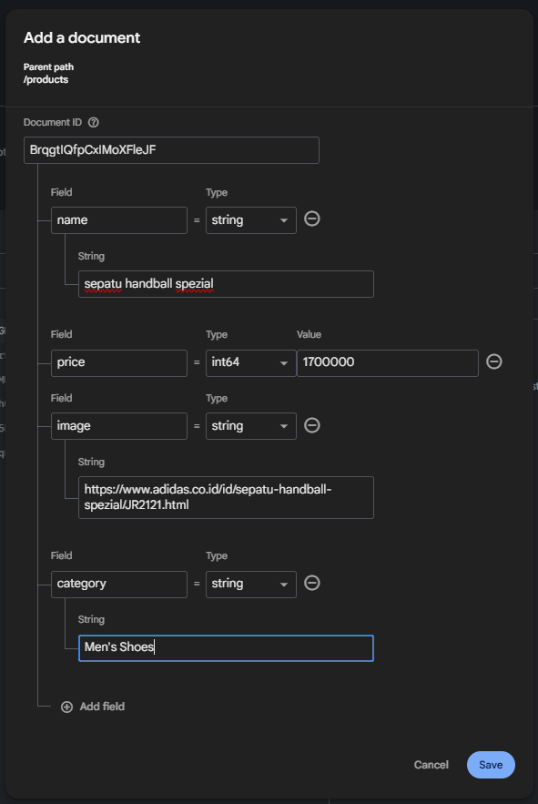
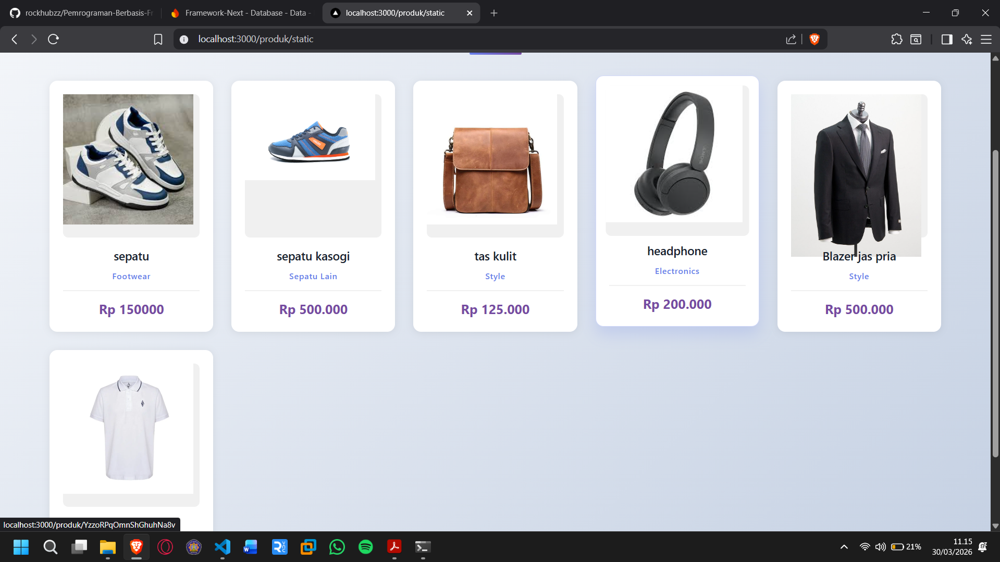
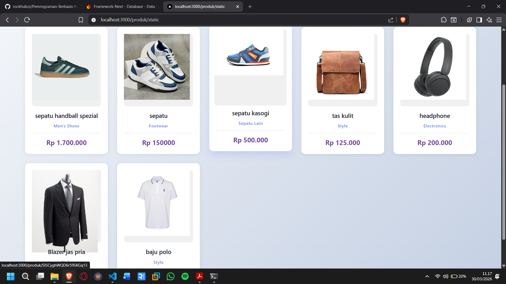
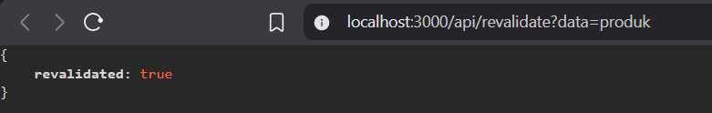
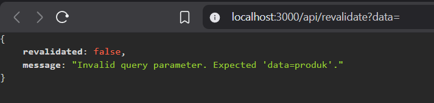
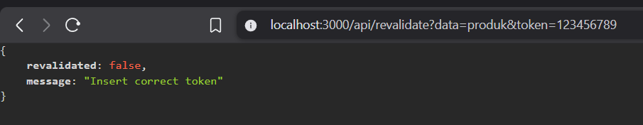
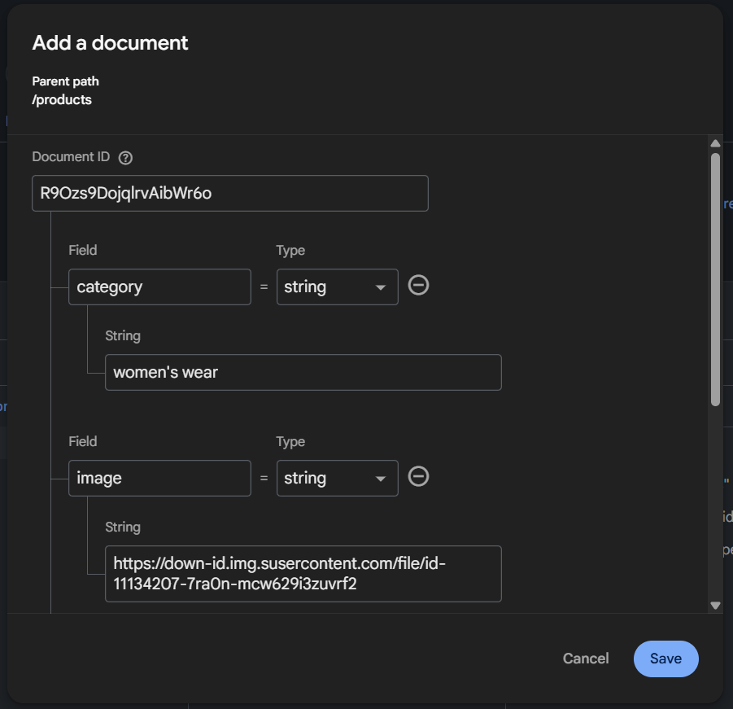
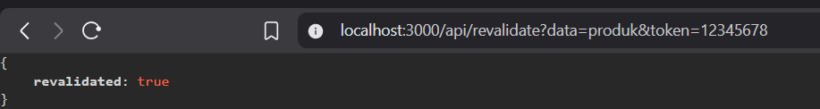
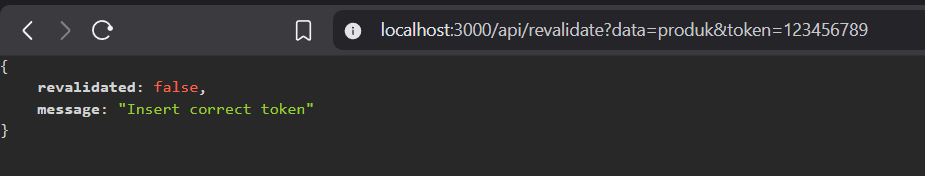
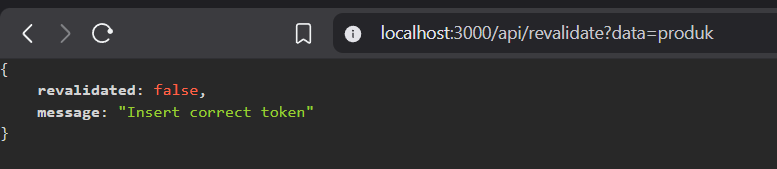

# Incremental Static Regeneration (ISR)

## Implementasi ISR Otomatis

### Bagian 1 – Tambahkan revalidate

- Buka halaman static.tsx pada folder src/pages/produk

```tsx
    revalidate: 10,
```

### Bagian 2 – Pengujian ISR

1. Jalankan: ( lakukan hal sama seperti JS sebelumnya untuk ngebuild SSG)
   - npm run build ( jika berhasil )

     ```shell
     Route (pages)                                   Revalidate  Expire
     ┌ ○ /
     ├   /_app
     ├ ○ /404
     ├ ○ /about
     ├ ƒ /api/[[...produk]]
     ├ ƒ /api/hello
     ├ ƒ /api/stores
     ├ ○ /auth/login
     ├ ○ /auth/register
     ├ ○ /blog/[slug]
     ├ ○ /category/[...slug]
     ├ ○ /produk
     ├ ● /produk/[produk] (1480 ms)
     │ ├ /produk/HjnApBuIHCqGRs4tohUE
     │ ├ /produk/SISCyghWQD6r59SKGq13
     │ ├ /produk/YmLit7NxajgMUcG4aEcW
     │ └ [+3 more paths]
     ├ ○ /produk/csr/[produk]
     ├ ƒ /produk/server
     ├ ● /produk/ssg/[produk] (6082 ms)                      1m      1y
     │ ├ /produk/ssg/HjnApBuIHCqGRs4tohUE (1016 ms)
     │ ├ /produk/ssg/SISCyghWQD6r59SKGq13 (1015 ms)
     │ ├ /produk/ssg/YmLit7NxajgMUcG4aEcW (1013 ms)
     │ ├ /produk/ssg/YzzoRPqOmnShGhuhNa8v (1013 ms)
     │ ├ /produk/ssg/pmfhHbqHj8e5BAmBFQdb (1013 ms)
     │ └ /produk/ssg/uI2Dij8284Xq5ECSahAw (1012 ms)
     ├ ƒ /produk/ssr/[produk]
     ├ ● /produk/static (1026 ms)                           10s      1y
     ├ ○ /profile
     ├ ○ /profile/edit
     ├ ○ /setting/app
     ├ ○ /shop/[[...slug]]
     ├ ○ /stores/csr
     ├ ● /stores/ssg (1017 ms)                               1h      1y
     ├ ƒ /stores/ssr
     ├ ○ /user
     └ ○ /user/password

     ○  (Static)   prerendered as static content
     ●  (SSG)      prerendered as static HTML (uses getStaticProps)
     ƒ  (Dynamic)  server-rendered on demand
     ```

   - npm run start

   ```shell
   PS C:\Users\raki\Documents\raki6\Pemrograman Berbasis Framework\Code\Praktikum\Praktikum 11\incremental-staticregeneration> npm run start

   > link-navigation@0.1.0 start
   > next start

   ▲ Next.js 16.1.6
   - Local:         http://localhost:3000
   - Network:       http://192.168.23.1:3000

   ✓ Starting...
   ✓ Ready in 2.3s
   ```

2. Tambahkan data baru di database pada firebase

   

3. Refresh halaman sebelum 10 detik → Data lama.
   - Sebelum 10 detik data yang akan ditampilkan masih data lama

   

4. Refresh setelah 10 detik → Data baru muncul.

   

---

## On-Demand Revalidation

### Bagian 1 – Buat API Revalidate

- Buat file revalidate.ts pada folder pages/api/ dan modifikasi

```ts
// Next.js API route support: https://nextjs.org/docs/api-routes/introduction
import type { NextApiRequest, NextApiResponse } from "next";

type Data = {
  revalidated: boolean;
};

export default async function handler(
  req: NextApiRequest,
  res: NextApiResponse<Data>,
) {
  try {
    await res.revalidate("/produk/static");
    return res.status(200).json({ revalidated: true });
  } catch (error) {
    console.error("Error in API route:", error);
    res.status(500).send({ revalidated: false });
  }
}
```

### Bagian 2 – Tambahkan Parameter Data

- Modifikasi file revalidate.ts

  ```ts
  // Next.js API route support: https://nextjs.org/docs/api-routes/introduction
  import type { NextApiRequest, NextApiResponse } from "next";

  type Data = {
    revalidated: boolean;
    message?: string;
  };

  export default async function handler(
    req: NextApiRequest,
    res: NextApiResponse<Data>,
  ) {
    if (req.query.data === "produk") {
      try {
        await res.revalidate("/produk/static");
        return res.status(200).json({ revalidated: true });
      } catch (error) {
        console.error("Error in API route:", error);
        res.status(500).send({ revalidated: false });
      }
    }

    return res.json({
      revalidated: false,
      message: "Invalid query parameter. Expected 'data=produk'.",
    });
  }
  ```

- Uji coba menambahkan parameter dan value pada url http://localhost:3000/api/revalidate?data=produk maka akan muncul true dan sesuai dengan kondisi (req.query.data ===”produk”)

  

- Uji coba dengan url http://localhost:3000/api/revalidate?data=

  

### Bagian 3 – Tambahkan Token Security

- Buka file .env dan modifikasi

  ```env
  REVALIDATE_TOKEN=12345678
  ```

- Modifikasi file revalidate.ts tambahkan kondisi pada line 13 - 17

  ```ts
  if (req.query.token !== process.env.REVALIDATE_TOKEN) {
    return res.status(401).json({
      revalidated: false,
      message: "Insert correct token",
    });
  }
  ```

### Pengujian Manual Revalidation

- Akses:<br>
  http://localhost:3000/api/revalidate?data=products&token=12345678

  Jika benar:

  

  Jika salah:

  

---

## Tugas Individu

1. Tambahkan lagi produk pada firebase

   

2. Implementasikan ISR dengan revalidate: 10.

   Pada /produk/static sudah terdapat implementasi revalidate setiap 10 detik:

   ```tsx
   export async function getStaticProps() {
     const res = await fetch("http://127.0.0.1:3000/api/produk");
     // const response: ProductType[] = await res.json();
     const response: { data: ProductType[] } = await res.json();

     // console.log("Data produk yang diambil dari API:", response);
     return {
       props: {
         products: response.data,
       },
       revalidate: 10,
     };
   }
   ```

3. Tambahkan endpoint On-Demand Revalidation.

   Sudah dibuat endpoint API untuk On-Demand Revalidation pada /api/revalidate:

   ```tsx
   if (req.query.data === "produk") {
     try {
       await res.revalidate("/produk/static");
       return res.status(200).json({ revalidated: true });
     } catch (error) {
       console.error("Error in API route:", error);
       res.status(500).send({ revalidated: false });
     }
   }
   ```

4. Tambahkan validasi token.

   Sudah dibuat validasi token pada /api/revalidate:

   ```tsx
   if (req.query.token !== process.env.REVALIDATE_TOKEN) {
     return res.status(401).json({
       revalidated: false,
       message: "Insert correct token",
     });
   }
   ```

5. Uji dengan:

- Token benar

  

- Token salah

  

- Tanpa token

  

---

## Pertanyaan Analisis

1. **Mengapa ISR lebih fleksibel dibanding SSG?**  
   ISR (Incremental Static Regeneration) lebih fleksibel karena memungkinkan halaman statis diperbarui tanpa harus melakukan build ulang seluruh aplikasi. Dengan ISR, data dapat diperbarui secara berkala atau berdasarkan trigger tertentu, sehingga tetap cepat namun lebih up-to-date dibanding SSG murni.

2. **Apa perbedaan revalidate waktu dan on-demand?**  
   Revalidate waktu (time-based) adalah pembaruan halaman secara otomatis setelah interval tertentu (misalnya setiap 60 detik). Sedangkan on-demand revalidation dilakukan secara manual melalui API atau trigger tertentu, sehingga halaman hanya diperbarui ketika benar-benar diperlukan.

3. **Mengapa endpoint revalidation harus diamankan?**  
   Karena endpoint ini dapat memicu pembaruan halaman. Jika tidak diamankan, siapa pun bisa mengaksesnya dan menyebabkan revalidation terus-menerus, yang dapat membebani server atau menyebabkan data tidak konsisten.

4. **Apa risiko jika token tidak digunakan?**  
   Tanpa token atau autentikasi, endpoint revalidation bisa disalahgunakan oleh pihak tidak bertanggung jawab. Risiko utamanya adalah spam request, beban server meningkat, hingga potensi serangan seperti denial-of-service (DoS).

5. **Kapan ISR lebih cocok dibanding SSR?**  
   ISR lebih cocok ketika membutuhkan performa tinggi seperti SSG, tetapi data tetap perlu diperbarui secara berkala. Misalnya pada halaman produk, blog, atau katalog yang tidak harus real-time, namun tetap perlu update tanpa rebuild manual.
