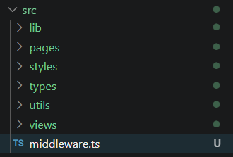
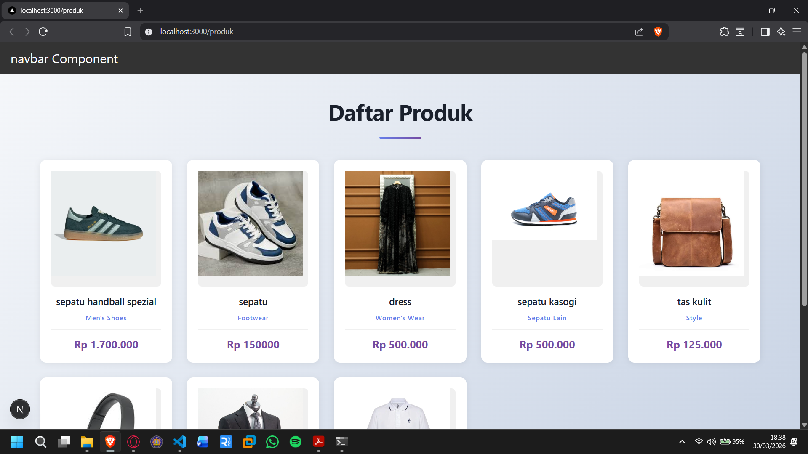
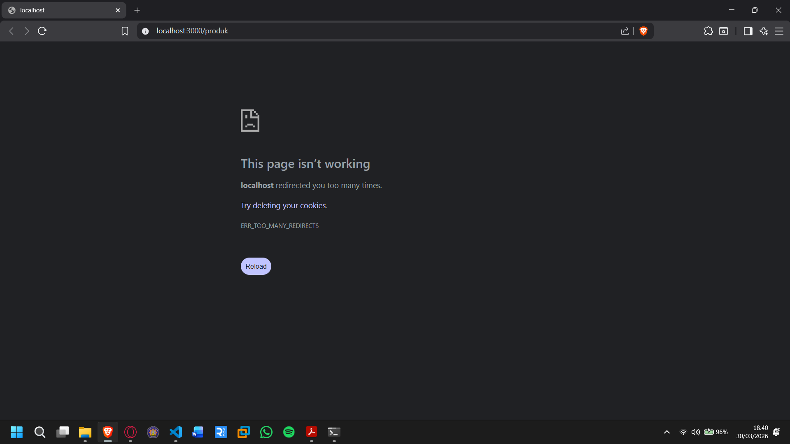
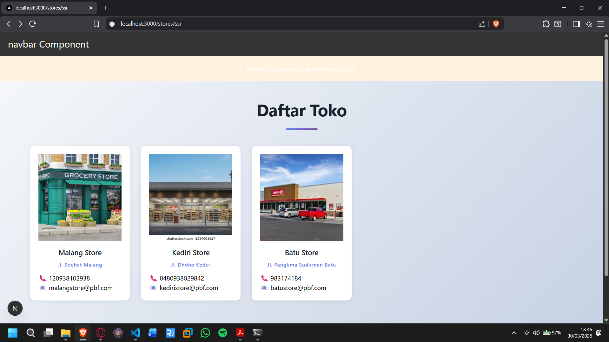
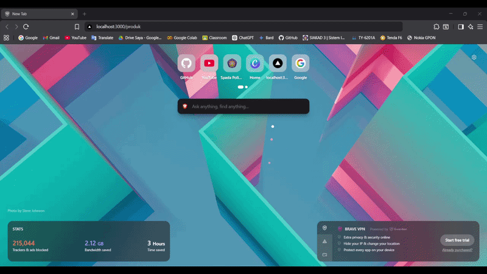
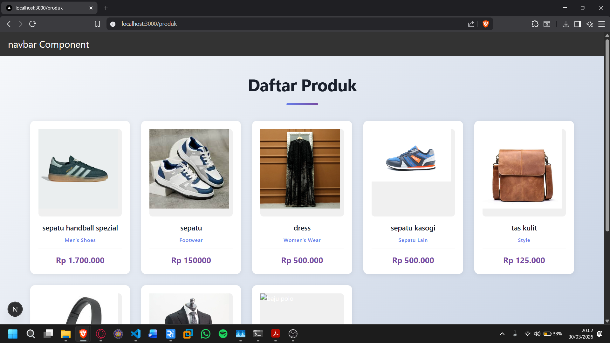
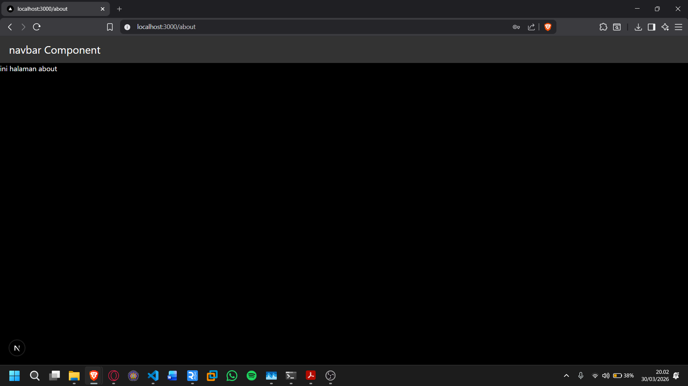
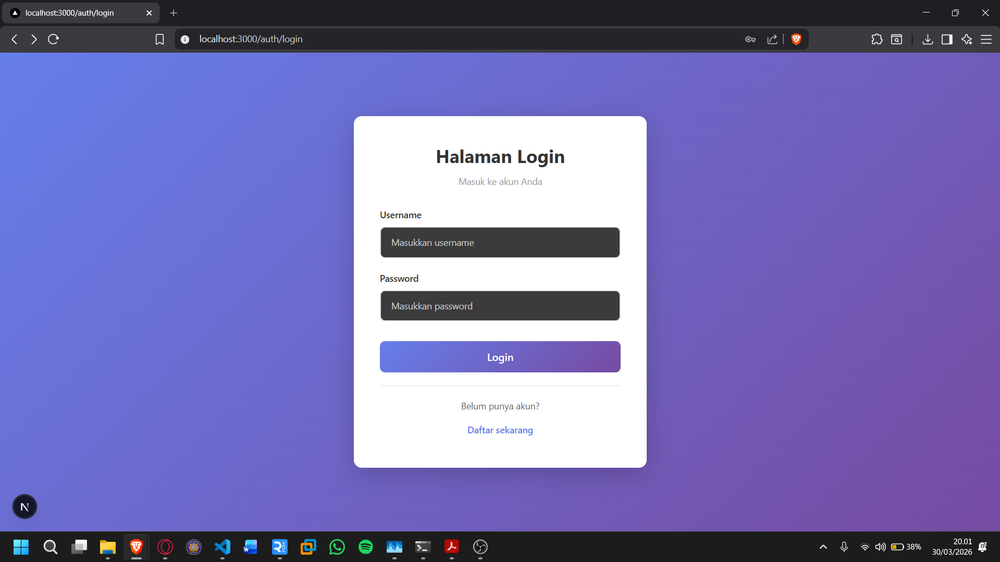
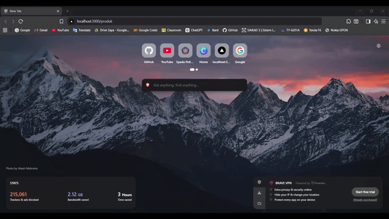

# Middleware & Route Protection

## Bagian 1 – Membuat Middleware

- Modifikasi file index.tsx pada folder src/pages/produk

  ```tsx
  import { useRouter } from "next/router";
  import { useEffect, useState } from "react";
  import TampilanProduk from "../../views/product";
  import useSWR from "swr";
  import fetcher from "../../utils/swr/fetcher";

  // const fetcher = (url: string) => fetch(url).then((res) => res.json());

  const kategori = () => {
    // const [isLogin, setIsLogin] = useState(true);
    const { push } = useRouter();
    const [products, setProducts] = useState([]);
    // console.log("products:", products);

    const { data, error, isLoading } = useSWR("/api/produk", fetcher);
    //cek apakah data, error, dan isLoading sudah benar...

    return (
      <div>
        <TampilanProduk products={isLoading ? [] : data.data} />
      </div>
    );
  };

  export default kategori;
  ```

- Buat file: src/middleware.ts Sejajar dengan folder pages.

  

---

## Bagian 2 – Struktur Dasar Middleware

/src/middleware.ts:

    ```ts
    import { NextResponse } from "next/server";
    import type { NextRequest } from "next/server";

    export function middleware(request: NextRequest) {
    return NextResponse.next();
    }
    ```

- Jika menggunakan NextResponse.next() → tidak ada redirect.
- Jadi masih bisa mengakses ke http://localhost:3000/produk:

  

---

## Bagian 3 – Redirect Sederhana

```tsx
return NextResponse.redirect(new URL("/produk", request.url));
```

- Semua halaman akan redirect ke home dan error dikarenakan terus menerus loading

  

---

## Bagian 4 – Batasi Route Tertentu

- Untuk mengatasi pada bagian 3 maka perlu pembatasan route

  ```tsx
  export const config = {
    matcher: ["/about", "/produk"],
  };
  ```

- Artinya:
  - Middleware hanya berlaku untuk /products dan /about
  - Halaman lain tetap normal
  - Ketika user mengakses halaman produk dan about maka akan langsung redirect ke halaman home

- Akses halaman produk:

  

- Akses halaman lain (stores):

  

---

## Bagian 5 – Simulasi Sistem Login

- Modifikasi file middleware.ts

```ts
if (!auth.isLogin) {
  return NextResponse.redirect(new URL("/auth/login", request.url));
} else {
  return NextResponse.next();
}
```

- Jika user langsung mengakses ke alamat http://localhost:3000/produk tidak akan bisa user akan diarahkan ke halaman login


---

## Pengujian

### Uji 1 – isLogin = false

Akses /produk


Hasil: Redirect ke /login

### Uji 2 – isLogin = true

Akses /produk setelah login


Hasil: Bisa mengakses /produk

### Uji 3 – Tambahkan Multiple Route



Sekarang:

- /products dan /about butuh login
- Halaman lain bebas

---

## Tugas Individu

1. Buat halaman:

- /products

  

- /about

  

- /login

  

2. Implementasikan Middleware:

- Redirect ke /login jika belum login.
- Izinkan akses jika login true.

  

3. Tambahkan proteksi hanya untuk route tertentu.

   ```ts
   export const config = {
     matcher: ["/about", "/produk"],
   };
   ```

4. Dokumentasikan:

- Screenshot sebelum dan sesudah redirect.

  

- Perbandingan dengan useEffect.

  

---
