# Sistem Autentikasi & Proteksi Route

## Bagian 1 – Install NextAuth

- npm install next-auth –force

  ```shell
  PS C:\Users\raki\Documents\raki6\Pemrograman Berbasis Framework\Code\Praktikum\Praktikum 13\sistem-autentikasi> npm install next-auth

  added 15 packages, and audited 505 packages in 19s

  162 packages are looking for funding
  run `npm fund` for details

  7 vulnerabilities (3 moderate, 4 high)

  To address issues that do not require attention, run:
  npm audit fix

  To address all issues, run:
  npm audit fix --force

  Run `npm audit` for details.
  ```

---

## Bagian 2 – Konfigurasi API Auth

- Buat file dan folder pada folder pages/api/auth/[...nextauth].ts

  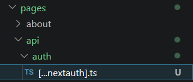

- Modifikasi file […nextauth].ts:

  ```ts
  import NextAuth, { NextAuthOptions } from "next-auth";
  import CredentialsProvider from "next-auth/providers/credentials";

  export const authOptions: NextAuthOptions = {
    session: {
      strategy: "jwt",
    },
    secret: process.env.NEXTAUTH_SECRET,
    providers: [
      CredentialsProvider({
        name: "credentials",
        credentials: {
          fullname: { label: "Full Name", type: "text" },
          email: { label: "Email", type: "email" },
          password: { label: "Password", type: "password" },
        },
        async authorize(credentials) {
          const user: any = {
            id: "1",
            email: credentials?.email,
            password: credentials?.password,
            fullname: credentials?.fullname,
          };

          if (user) {
            return user;
          } else {
            return null;
          }
        },
      }),
    ],

    callbacks: {
      async jwt({ token, account, profile, user }: any) {
        if (account?.provider === "credentials" && user) {
          token.email = user.email;
        }
        return token;
      },

      async session({ session, token }: any) {
        if (token.email) {
          session.user.email = token.email;
        }
        return session;
      },
    },
  };

  export default NextAuth(authOptions);
  ```

---

## Bagian 3 – Tambahkan Secret

- Buka file .env.local dan tambahkan code pada line 12
  - NEXTAUTH_SECRET=RANDOM_BASE64_STRING
  - Untuk mendapatkan nilai RANDOM_BASE64_STRING gunakan generator RANDOM_BASE64_STRING seperti https://www.convertsimple.com/random-base64-generator/

  ```env
  NEXTAUTH_SECRET=RANDOM_BASE64_STRING
  ```

---

## Bagian 4 – Tambahkan SessionProvider

- Buka file \_app.tsx dan modifikasi:

  ```tsx
    import { SessionProvider } from "next-auth/react"

      <SessionProvider session={pageProps.session}>
          <!-- kode lain -->
      </SessionProvider>
  ```

---

## Bagian 5 – Tambahkan Tombol Login & Logout

- Buka index.tsx pada folder component/navbar:
- Modifikasi file index.tsx pada line 10 dan 2

  ```tsx
  <button onClick={() => signIn()}>Sign In</button>
  ```

- Buka file file navbar.module.scss tambahkan code pada line 9

  ```css
  justify-content: space-between;
  ```

- Jalankan http://localhost:3000/

  

- Jika di klik sign in maka akan muncul dan isikan textbox masing. Setelah itu klik button sign in dan setelah diklik maka akan kembali ke halaman localhost

  

- Setelah berhasil login maka akan muncul session

  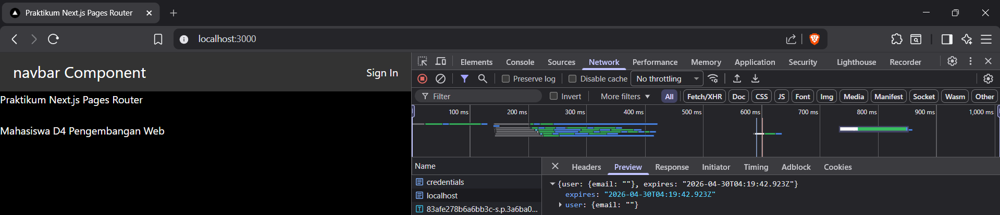

- Untuk dapat menangkap data pada session maka tambahkan code sebagai berikut :

  ```tsx
      const { data } = useSession()

        <div className="big">navbar Component </div>
        {data ? (
            <button onClick={() => signOut()}>Sign Out</button>
        ) : (
            <button onClick={() => signIn()}>Sign In</button>
        )}
  ```

- Uji coba sign in dan sign out
  - Jalankan Kembali npm run dev
  - Jalankan localhost

    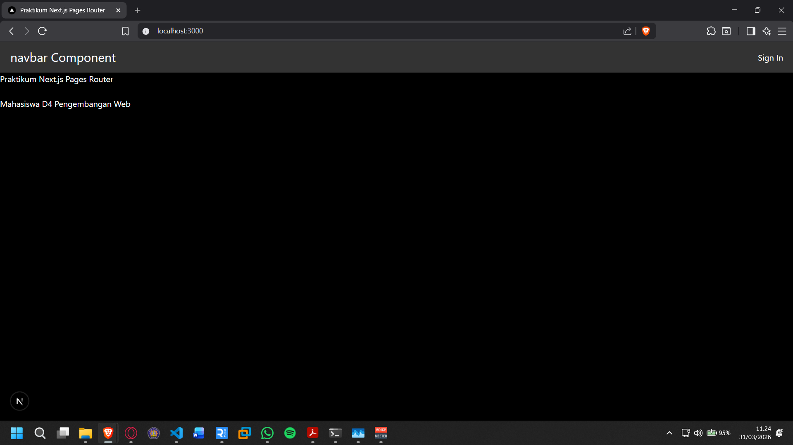

  - Klik sign in dan isikan textboxnya

    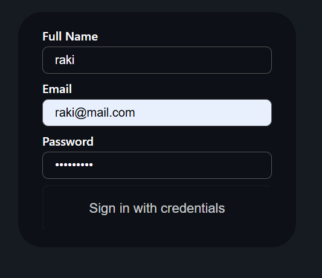

  - Maka akan muncul tombol signout

    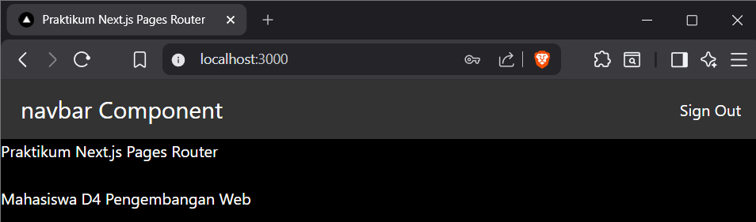

  - Ketika user klik signout maka akan kembali sign in

    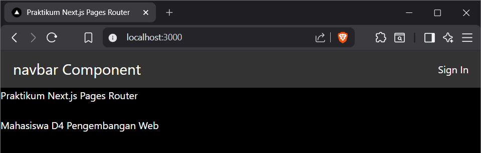

---

## Menambahkan Data Tambahan (Full Name)

- Buka file [...nextauth].js dan tambahkan code pada line 22

  ```ts
  const user: any = {
    id: "1",
    email: credentials?.email,
    password: credentials?.password,
    fullname: credentials?.fullname,
  };
  ```

- Pada callbacks modifikasi codenya menjadi berikut :

  ```ts
  token.fullname = user.fullname;

  if (token.fullname) {
    session.user.name = token.fullname;
  }
  ```

- Modifikasi navbar.module.scss

  ```css
  .navbar {
    width: 100%;
    height: 70px;
    padding: 0 60px;

    display: flex;
    align-items: center;
    justify-content: space-between;

    background: linear-gradient(135deg, #0f172a, #1e293b);
    color: #ffffff;

    box-shadow: 0 4px 20px rgba(0, 0, 0, 0.2);
    border-bottom-left-radius: 16px;
    border-bottom-right-radius: 16px;
  }
  ```

- Modifikasi index.tsx pada folder components/layouts/navbar

  ```tsx
  import styles from "./navbar.module.css";
  import { signIn, signOut, useSession } from "next-auth/react";

  const Navbar = () => {
    const { data }: any = useSession();
    // const { data: session } = useSession()
    // console.log("session", session)
    return (
      <div className={styles.navbar}>
        <div className={styles.navbar__brand}>MyApp</div>

        <div className={styles.navbar__right}>
          {data ? (
            <>
              <div className={styles.navbar__user}>
                Welcome, {data.user?.fullname}
              </div>
              <button
                className={`${styles.navbar__button} ${styles["navbar__button--danger"]}`}
                onClick={() => signOut()}
              >
                Sign Out
              </button>
            </>
          ) : (
            <button
              className={`${styles.navbar__button} ${styles["navbar__button--primary"]}`}
              onClick={() => signIn()}
            >
              Sign In
            </button>
          )}
        </div>
      </div>
    );
  };

  export default Navbar;
  ```

- Jalankan browser pada localhost

  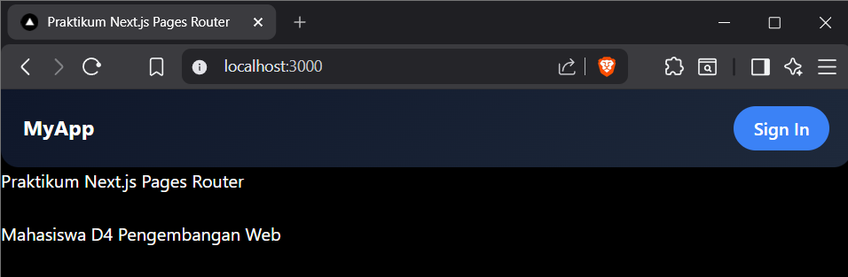

- Lakukan sign in

  

  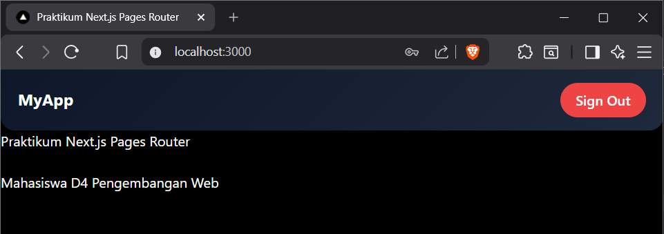

---

## Proteksi Halaman Profile

- Buat Halaman Profile
  - Modifikasi file pages/profile/index.tsx

    ```tsx
    <div>
      <h1>Halaman Profile</h1>
      <br />
      <h1>Selamat Datang {data?.user?.fullname}</h1>
    </div>
    ```

  - jalankan browser

    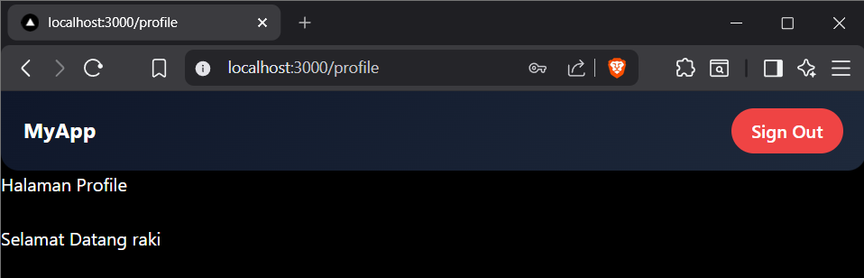

- Buat Middleware Authorization
  - Buat file withAuth.ts dan folder dengan nama middleware di src

    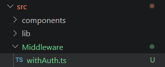

  - Modifikasi withAuth.ts

    ```ts
    import { getToken } from "next-auth/jwt";
    import {
      NextFetchEvent,
      NextMiddleware,
      NextRequest,
      NextResponse,
    } from "next/server";

    export default function withAuth(
      middleware: NextMiddleware,
      requireAuth: string[] = [],
    ) {
      return async (req: NextRequest, next: NextFetchEvent) => {
        const pathname = req.nextUrl.pathname;

        if (requireAuth.includes(pathname)) {
          const token = await getToken({
            req,
            secret: process.env.NEXTAUTH_SECRET,
          });

          if (!token) {
            const loginUrl = new URL("/login", req.url);
            return NextResponse.redirect(loginUrl);
          }
        }
        return middleware(req, next);
      };
    }
    ```

  - Modifikasi file middleware.ts

    ```ts
    import { getToken } from "next-auth/jwt";
    import {
      NextFetchEvent,
      NextMiddleware,
      NextRequest,
      NextResponse,
    } from "next/server";

    export default function withAuth(
      middleware: NextMiddleware,
      requireAuth: string[] = [],
    ) {
      return async (req: NextRequest, next: NextFetchEvent) => {
        const pathname = req.nextUrl.pathname;

        if (requireAuth.includes(pathname)) {
          const token = await getToken({
            req,
            secret: process.env.NEXTAUTH_SECRET,
          });

          if (!token) {
            const loginUrl = new URL("/", req.url);
            return NextResponse.redirect(loginUrl);
          }
        }
        return middleware(req, next);
      };
    }
    ```

  - Jika user mengarahkan ke halaman profile tidak akan bisa, user akan diarahkan ke alamat localhost

    

---

## Pengujian

### Uji 1 – Belum Login

Akses /profile


Hasil: Redirect ke home

### Uji 2 – Sudah Login

Login terlebih dahulu → Akses /profile


Hasil: Bisa masuk

### Uji 3 – Logout

Klik Sign Out → Akses /profile


Hasil: Tidak bisa masuk

---

## Tugas Praktikum

1. Implementasikan login menggunakan Credentials Provider.
2. Tambahkan field full name.
3. Tampilkan full name setelah login.
4. Buat halaman profile.
5. Lindungi halaman profile dengan middleware.
6. Dokumentasikan:
   - Screenshot login

     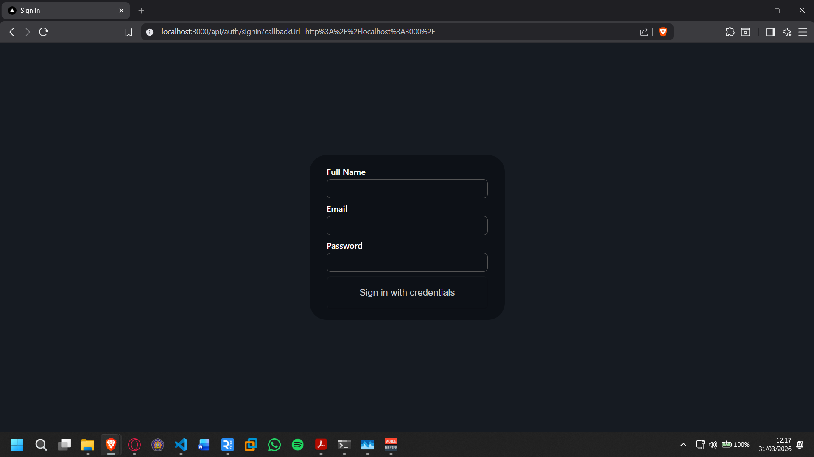

   - Screenshot session

     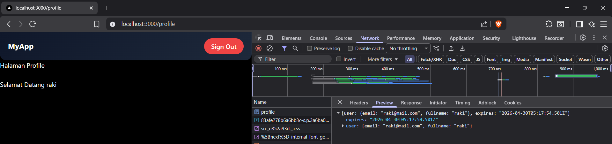

   - Screenshot redirect middleware

     

---

## Pertanyaan Analisis

1. **Mengapa session menggunakan JWT?**  
   JWT (JSON Web Token) digunakan karena bersifat stateless, sehingga server tidak perlu menyimpan session di database. Token dapat menyimpan informasi user dan diverifikasi setiap request, membuatnya lebih efisien dan mudah di-scale.

2. **Apa perbedaan authorize() dan callback jwt()?**  
   authorize() digunakan saat proses login untuk memvalidasi kredensial user (misalnya email dan password). Sedangkan callback jwt() digunakan setelah login untuk mengatur atau menambahkan data ke dalam token JWT yang akan digunakan pada session.

3. **Mengapa middleware perlu getToken()?**  
   Middleware menggunakan getToken() untuk membaca dan memverifikasi JWT dari request. Dengan ini, middleware dapat mengetahui apakah user sudah login atau belum sebelum memberikan akses ke halaman tertentu.

4. **Apa risiko jika NEXTAUTH_SECRET tidak digunakan?**  
   Tanpa NEXTAUTH_SECRET, token JWT tidak memiliki kunci enkripsi yang aman. Hal ini bisa menyebabkan token mudah dipalsukan atau dimanipulasi, sehingga berisiko terhadap keamanan sistem.

5. **Apa perbedaan autentikasi dan otorisasi dalam sistem ini?**  
   Autentikasi adalah proses memastikan identitas user (misalnya login). Sedangkan otorisasi adalah proses menentukan apakah user tersebut memiliki hak akses ke resource tertentu setelah berhasil login.
