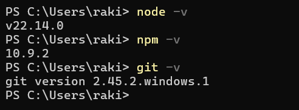
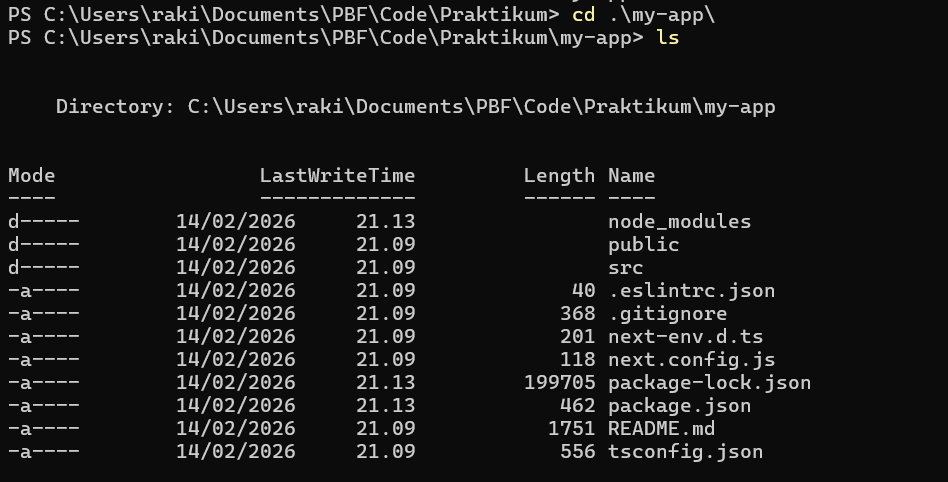
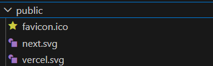
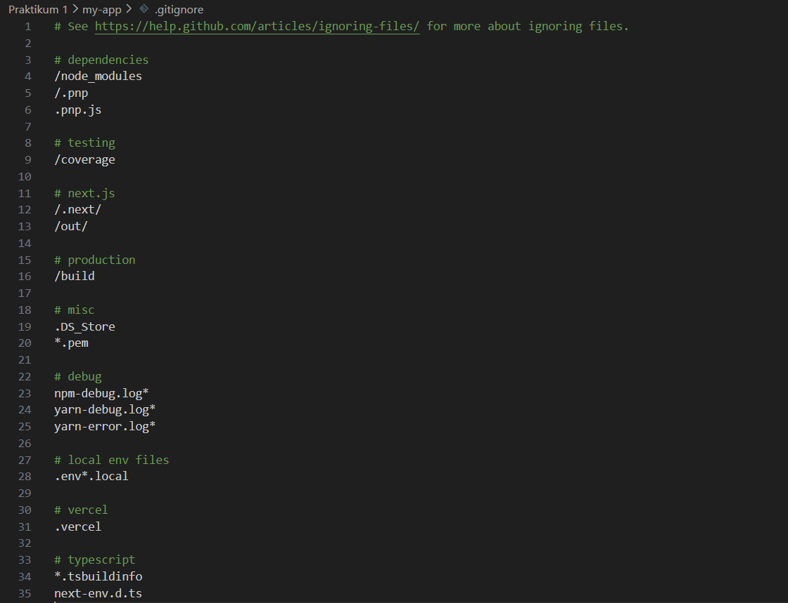
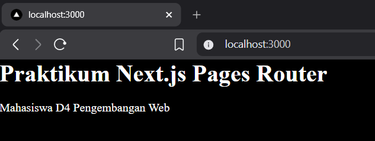
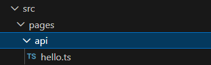
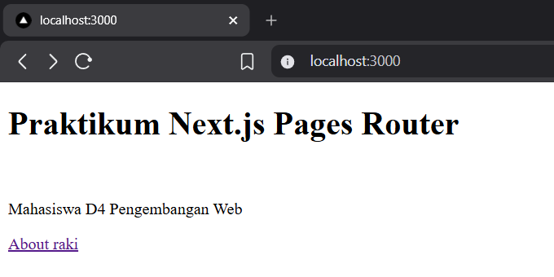

# Laporan Jobsheet 2 - Setup Project Next.js menggunakan Pages Router

<b>Langkah 1 – Pengecekan Lingkungan</b>

1. Buka terminal / command prompt.
2. Jalankan perintah berikut:
3. node -v
4. npm -v
5. git -v



<b>Langkah 2 – Membuat Project Next.js</b>

1. Buat direktori baru dan masuk ke direktori kerja<br>
   

2. Jalankan perintah:<br>
   

3. Masuk ke folder projectnya<br>
   

<b>Langkah 3 – Menjalankan Server Development</b>

1. Masuk ke folder project:<br>
   

2. Jalankan aplikasi:<br>
   

3. Buka browser dan akses: http://localhost:3000<br>
   

<b>Langkah 4 – Mengenal Struktur Folder</b>

Amati folder utama:<br>
• pages/ → tempat routing halaman<br>


• public/ → aset statis<br>


• styles/ → file CSS<br>


• package.json → konfigurasi project<br>


• gitIgnore -> file konfigurasi di Git yang berfungsi untuk memberitahu Git file atau folder apa saja yang TIDAK perlu di-track / di-commit ke repository.<br>


<b>Langkah 5 – Modifikasi Halaman Utama</b></br>

1. Buka file: pages/index.js, Ubah isi halaman, misalnya:

```tsx
import Head from "next/head";
import Image from "next/image";
import { Inter } from "next/font/google";
import styles from "@/styles/Home.module.css";

const inter = Inter({ subsets: ["latin"] });

export default function Home() {
  return (
    <div>
      <h1>Praktikum Next.js Pages Router</h1> <br />
      <p>Mahasiswa D4 Pengembangan Web</p>
    </div>
  );
}
```

2. Simpan dan lihat perubahan di browser.<br>
   

<b>Langkah 6 – Modifikasi API</b>

1. Buka folder api<br>
   

2. Modifikasi hello.ts

```ts
// Next.js API route support: https://nextjs.org/docs/api-routes/introduction
import type { NextApiRequest, NextApiResponse } from "next";

type Data = {
  name: string;
  alamat: string;
};

export default function handler(
  req: NextApiRequest,
  res: NextApiResponse<Data>,
) {
  res.status(200).json({ name: "John Doe", alamat: "jl.suka suka no 1" });
}
```

3. Jalankan browser dengan Alamat http://localhost:3000/api/hello<br>
   

Catatan: Pada saat screenshot di atas dilakukan, extension "JSON Formatter" sudah terinstall

<b>Langkah 7 – Modifikasi Background</b>

1. Buka file \_app.tsx
2. Modifikasi menjadi berikut

```tsx
// import '@/styles/globals.css'
import type { AppProps } from "next/app";

export default function App({ Component, pageProps }: AppProps) {
  return <Component {...pageProps} />;
}
```

3. Jalankan localhost<br>
   

<b>Langkah 8 – Setup ext pada VSCode (opsional)</b><br>


<b>Tugas 1 (Wajib)</b><br>
• Buat halaman baru about.js di folder pages.<br>
• Tampilkan:<br>
o Nama Mahasiswa<br>
o NIM<br>
o Program Studi<br>

Code about.tsx:

```tsx
import Head from "next/head";
import Image from "next/image";
import { Inter } from "next/font/google";
import styles from "@/styles/Home.module.css";

const inter = Inter({ subsets: ["latin"] });

export default function Home() {
  return (
    <div>
      <p>Nama: Rocky Alessandro Kristanto</p>
      <p>NIM: 2341720197</p>
      <p>Program Studi: Teknik Informatika</p>
    </div>
  );
}
```

Output:<br>


<b>Tugas 2 (Pengayaan)</b><br>
• Tambahkan minimal 1 link navigasi dari halaman utama ke halaman about.

Code index.tsx:

```tsx
import Head from "next/head";
import Image from "next/image";
import { Inter } from "next/font/google";
import styles from "@/styles/Home.module.css";

const inter = Inter({ subsets: ["latin"] });

export default function Home() {
  return (
    <div>
      <h1>Praktikum Next.js Pages Router</h1> <br />
      <p>Mahasiswa D4 Pengembangan Web</p>
      <a href="/about">About raki</a>
    </div>
  );
}
```

Output:<br>
<br>
Ketika hyperlink "About raki" diklik akan diarahkan ke page about<br>
<video controls src="imgs/JS2/2026-02-14 22-22-28.mp4" title="Title"></video>

<b>Pertanyaan Refleksi</b><br>

1. Mengapa Pages Router disebut sebagai routing berbasis file?<br>
   Jawab: Karena routing pages mengikuti struktur file code tanpa perlu setting router secara manual

2. Apa perbedaan Next.js dengan React standar (CRA)?<br>
   Jawab: React standar (CRA) adalah library UI yang default-nya menggunakan Client Side Rendering, sehingga routing dan fitur backend harus ditambahkan manual. Sedangkan Next.js adalah framework berbasis React yang menyediakan routing otomatis, SSR/SSG untuk SEO dan performa lebih baik, serta API routes bawaan.

3. Apa fungsi perintah npm run dev?<br>
   Jawab: Perintah npm run dev berfungsi untuk menjalankan web server dalam mode development sehingga halaman akan selalu hot reload dengan perubahan kode secara otomatis.

4. Apa perbedaan npm run dev dan run build ?<br>
   Jawab: npm run dev digunakan untuk menjalankan aplikasi dalam mode pengembangan (development), sehingga perubahan kode langsung ter-update (hot reload) dan lebih mudah untuk debugging.Sedangkan npm run build digunakan untuk membuat versi produksi (production) yang sudah dioptimasi agar lebih cepat dan siap untuk di-deploy.
