# Laporan Jobsheet 3 - Routing, Nested Routing, Dynamic Routing, dan Layouting pada Next.js (Pages Router)

<b>1. Routing Dasar (Static Routing)</b><br>
<b>a. Struktur Awal</b><br>
pages/<br>
└── index.tsx<br>

<b>b. Tambahkan Halaman About</b><br>
<br>

<b>c. Uji di Browser</b><br>
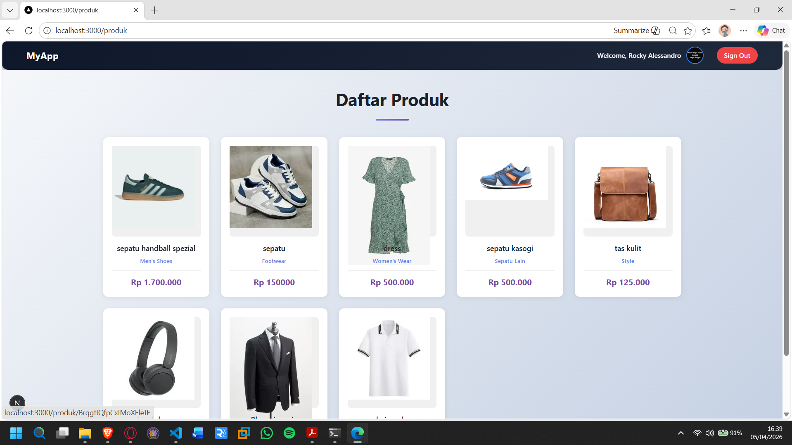<br>

<b>2. Routing Menggunakan Folder<br>
a. Rapikan Struktur Pages</br></b>
Ubah struktur menjadi:<br>
pages/<br>
└── about/<br>
└── index.tsx ( yang sebelumnya about.tsx menjadi index.tsx )

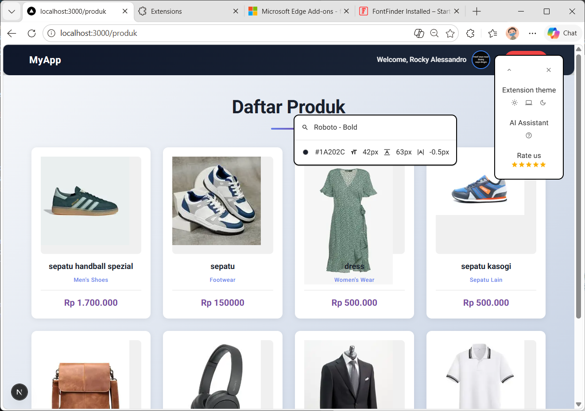

Akses /about<br>
Insight: index.tsx di dalam folder mewakili root folder tersebut.

<b>b. Akses dari halaman browser ( tetap sama tetapi lebih rapi )</b>

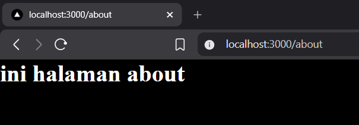

<b>3. Nested Routing<br>
a. Buat Folder Setting</b></br>

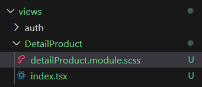

Modifikasi kodenya<br>

<li>user.tsx

```tsx
const UserSettingPage = () => {
  return (
    <div>
        User Setting Page
    </div>;
  )
};

export default UserSettingPage;
```

<li>app.tsx

```tsx
const AppSetting = () => {
    return  (
        <div>
            App Setting Page
        </div>;
)
};

export default AppSetting;
```

Akses:

<li>/setting/user

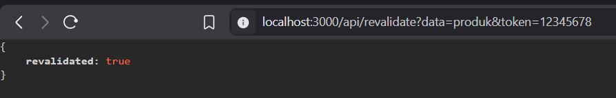

<li>/setting/app

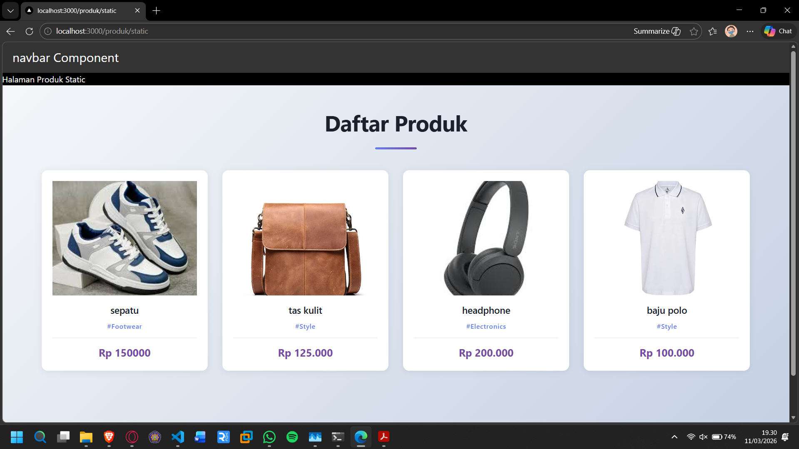

Modifikasi struktur folder pages dengan menambahkan folder user dan user.tsx pada setting dipindah ke folder user dan rubah file user.tsx menjadi index.tsx

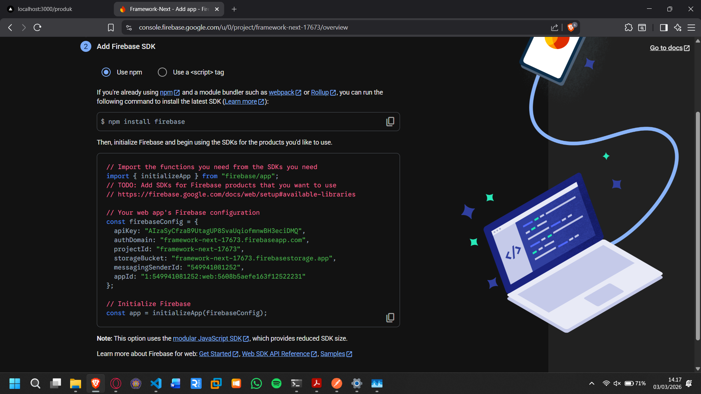

Jalankan pada browser

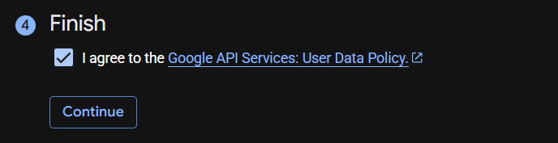

<b>b. Nested Lebih Dalam</b>

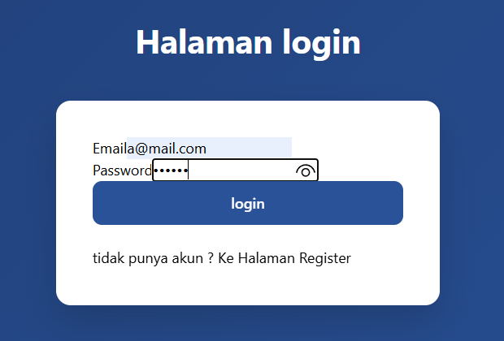

Akses /user/password

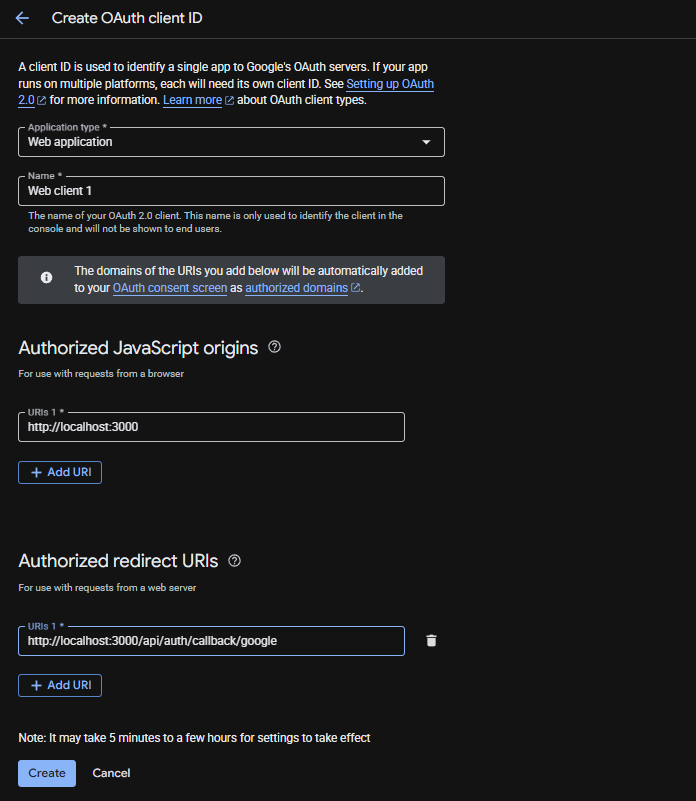

<b>4. Dynamic Routing<br>
a. Buat Halaman Produk</b>

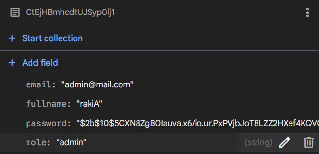

<li>Modifikasi index.tsx

```tsx
const produk = () => {
  return ()
    <div>
        Produk User Page
    </div>;
};

export default produk;
```

<li> Modifikasi [id].tsx

Buka browser http://localhost:3000/produk/sepatu tambahkan segment sepatu

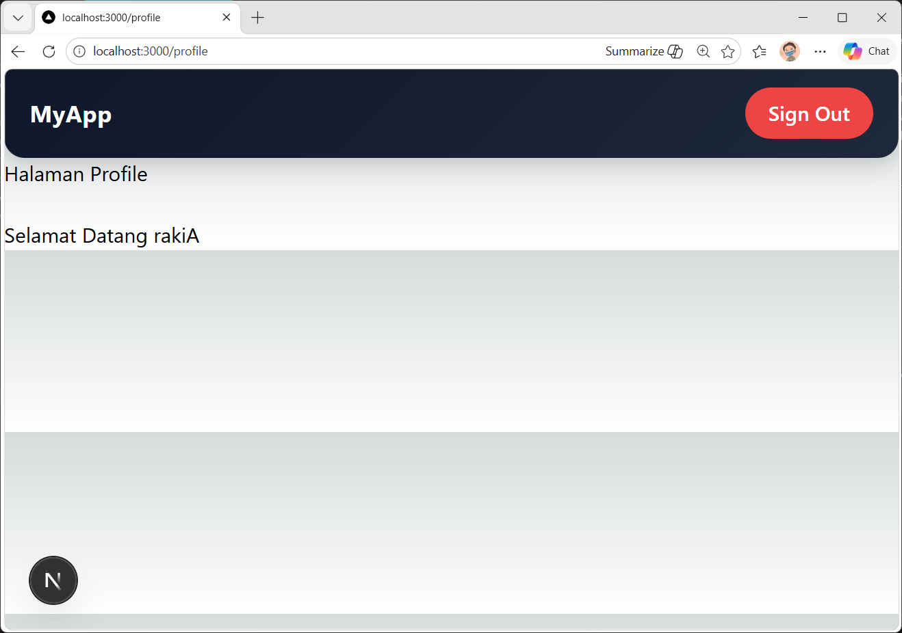

<li> Cek menggunakan console.log

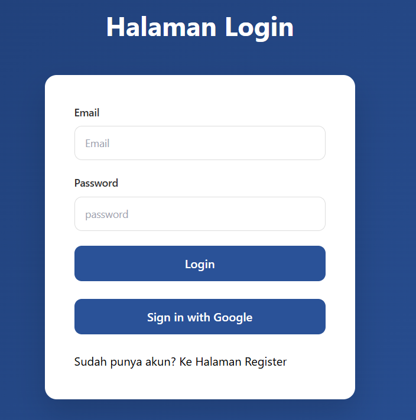

<li>Modifikasi [id].tsx agar dapat mengambil nilai dari id

```tsx
import { useRouter } from "next/router";

const HalamanProduk = () => {
  // const Router = useRouter();
  // console.log(Router);
  const { query } = useRouter();

  return (
    <div>
      <h1>Halaman Produk</h1>
      <p>Produk: {query.id}</p>
    </div>
  );
};

export default HalamanProduk;
```

<li>Buka browser

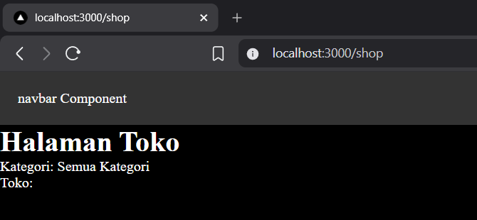

<b>c. Uji di Browser</b>

<li> /produk/sepatu-baru

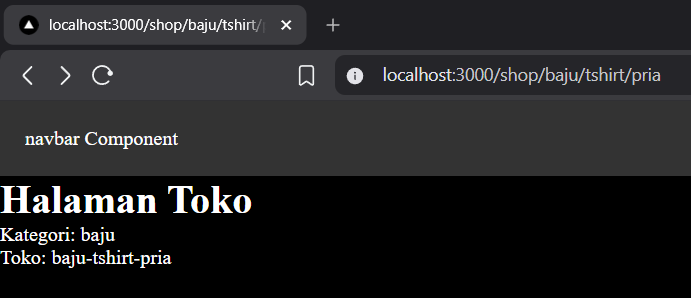

<li> /produk/baju

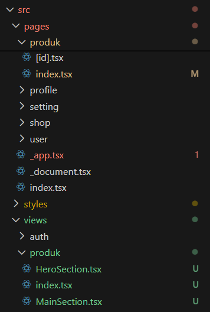

<b>5. Membuat Komponen Navbar <br>
a. Struktur Komponen</b>

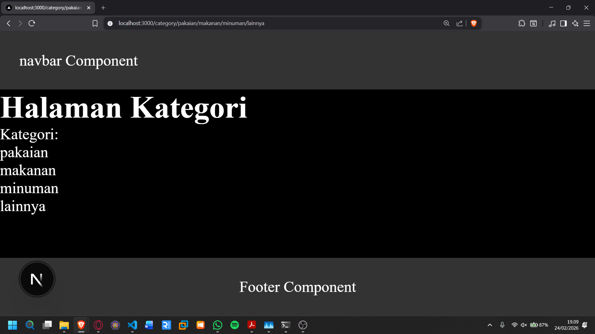

Modifikasi index.tsx

```tsx
const Navbar = () => {
  return (
    <div className="">
      <div>navbar Component </div>
    </div>
  );
};

export default Navbar;
```

Buka globals.css untuk nantinya digunakan pada style navbar

Modifikasi global.css

```css
* {
  box-sizing: border-box;
  padding: 0;
  margin: 0;
}

html,
body {
  max-width: 100vw;
  overflow-x: hidden;
}

a {
  color: inherit;
  text-decoration: none;
}
```

Modifikasi index.tsx dengan menambahkan classname untuk style navbar

```tsx
const Navbar = () => {
  return (
    <div className="navbar">
      <div>navbar Component </div>
    </div>
  );
};

export default Navbar;
```

Modifikasi globals.css

```css
.navbar {
  width: 100%;
  height: 60px;
  background-color: #333;
  color: white;
  display: flex;
  align-items: center;
  padding: 0 20px;
}
```

Modifikasi index.tsx pada folder pages

```tsx
import Head from "next/head";
import Image from "next/image";
import { Inter } from "next/font/google";
import styles from "@/styles/Home.module.css";
import Navbar from "@/components/layouts/navbar";

const inter = Inter({ subsets: ["latin"] });

export default function Home() {
  return (
    <div>
      <Navbar />
      <h1>Praktikum Next.js Pages Router</h1> <br />
      <p>Mahasiswa D4 Pengembangan Web</p>
    </div>
  );
}
```

Modifikasi \_app.tsx ( pastikan import styles dalam keadaan aktif)

```tsx
import "@/styles/globals.css";
import type { AppProps } from "next/app";

export default function App({ Component, pageProps }: AppProps) {
  return <Component {...pageProps} />;
}
```

Jalankan di browser ( Navbar akan tampil )

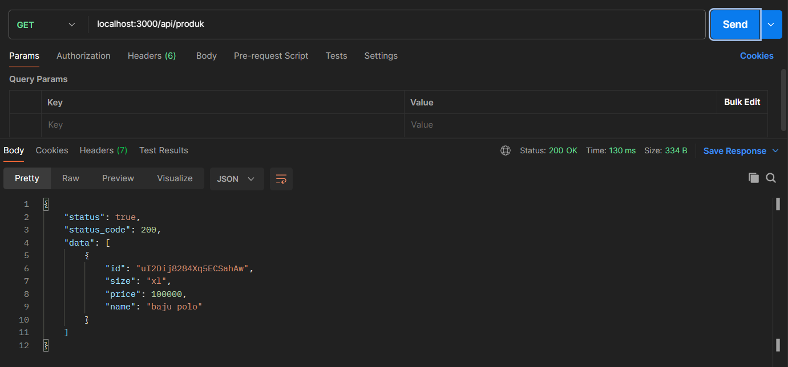

<b>Modifikasi navbar agar tampil di semua page</b><br>
Modifikasi index.tsx pada folder page ( hapus navbar )

```tsx
import Head from "next/head";
import Image from "next/image";
import { Inter } from "next/font/google";
import styles from "@/styles/Home.module.css";
import Navbar from "@/components/layouts/navbar";

const inter = Inter({ subsets: ["latin"] });

export default function Home() {
  return (
    <div>
      <h1>Praktikum Next.js Pages Router</h1> <br />
      <p>Mahasiswa D4 Pengembangan Web</p>
    </div>
  );
}
```

Modifikasi \_app.tsx ( Menambahkan navbar )

```tsx
import "@/styles/globals.css";
import type { AppProps } from "next/app";
import Navbar from "@/components/layouts/navbar";

export default function App({ Component, pageProps }: AppProps) {
  return (
    <div>
      <Navbar />
      <Component {...pageProps} />
    </div>
  );
}
```

Jalankan browser

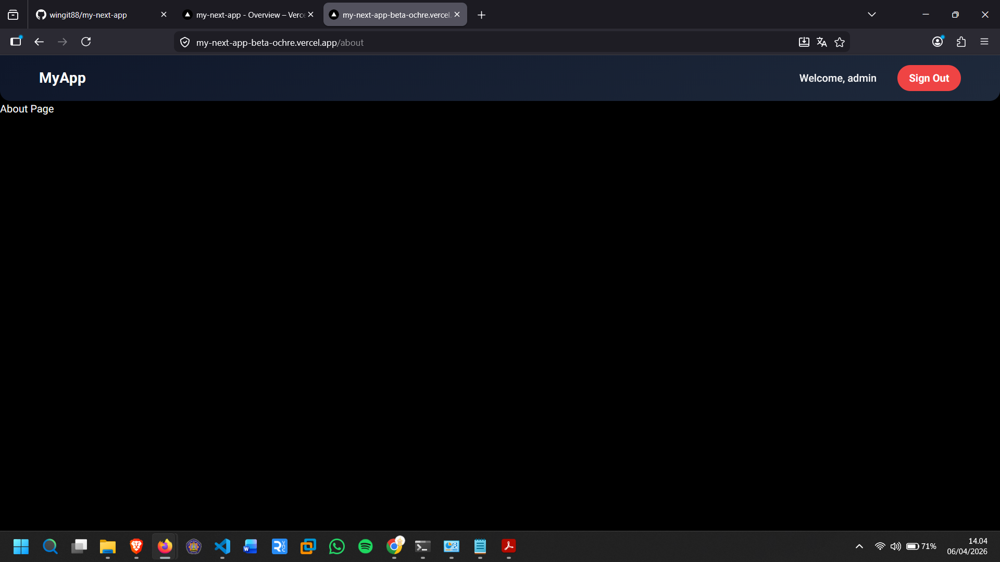

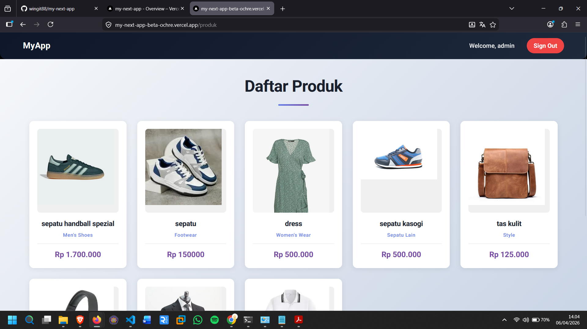

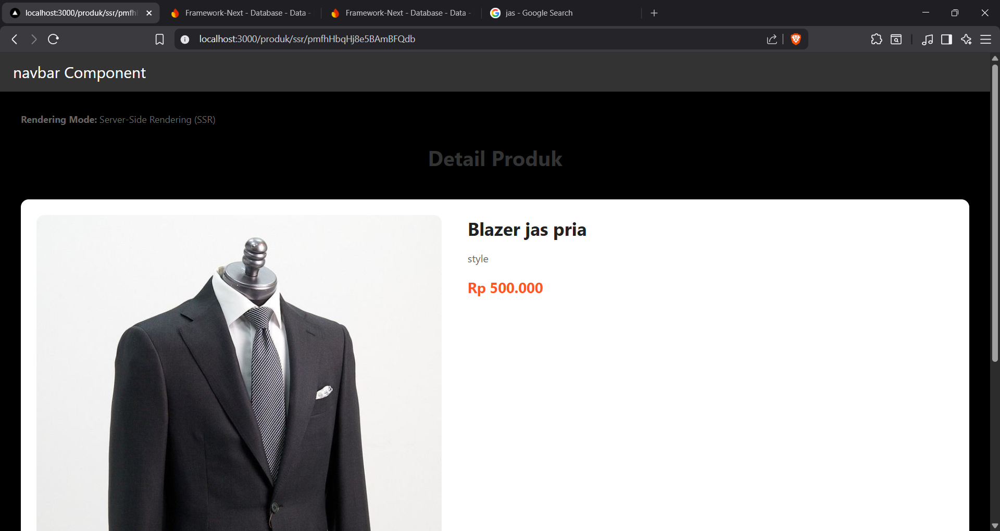

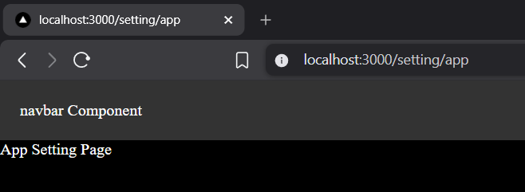

<b>6. Membuat Layout Global (App Shell)<br>
a. Buat AppShell</b>


Modifikasi index.tsx pada AppShell

```tsx
import Navbar from "../navbar";

type AppShellProps = {
  children: React.ReactNode;
};

const AppShell = (props: AppShellProps) => {
  const { children } = props;

  return (
    <main>
      <Navbar />
      {children}
    </main>
  );
};

export default AppShell;
```

<b>7. Implementasi Layout di \_app.tsx</b>

```tsx
import "@/styles/globals.css";
import type { AppProps } from "next/app";
import AppShell from "@/components/layouts/Appshell";
import Navbar from "@/components/layouts/navbar";

export default function App({ Component, pageProps }: AppProps) {
  return (
    <AppShell>
      <Component {...pageProps} />
    </AppShell>
  );
}
```

Modifikasi pada \_app.tsx tambahkan footer seperti pada gambar dan amati hasilnya

```tsx
const { children } = props;

return (
  <main>
    <Navbar />
    {children}
    <div>footer</div>
  </main>
);
```

/about

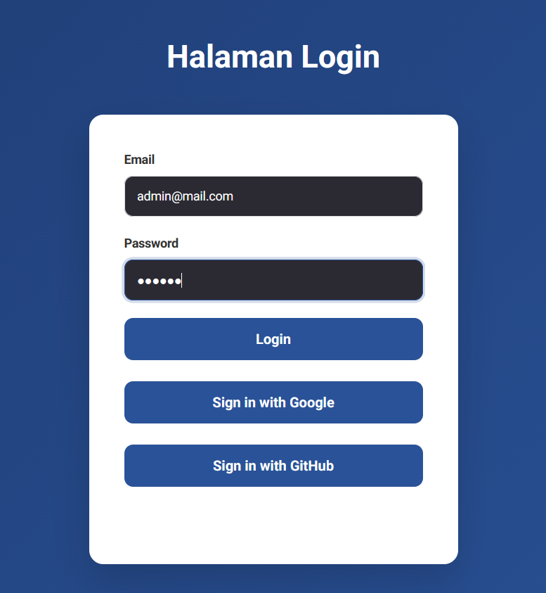

/ (index pages)


<b>Tugas 1 - Routing</b>

1.  Buat halaman:
<li>/profile

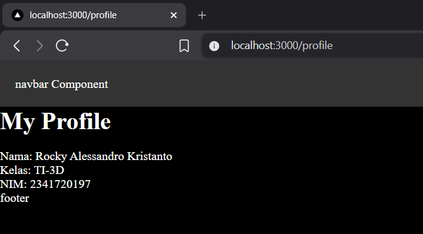

<li>/profile/edit

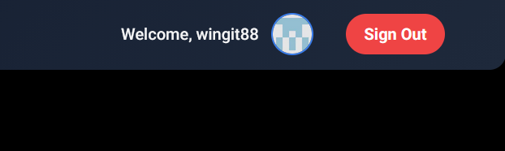

<b>Tugas 2 – Dynamic Routing</b>

1. Buat routing:
2. /blog/[slug]
3. Tampilkan nilai slug di halaman

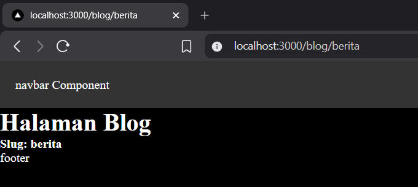
