# Custom Document dan Custom Error Page pada Next.js

<b>Langkah 1 – Menjalankan Project</b>

1. Buka folder project.
2. Jalankan:
3. npm run dev
4. Akses:
5. http://localhost:3000
6. Jika saat dirun ada kendala tampilan index lama tampil <li>Uninstall package Tailwind
<li>npm uninstall tailwindcss postcss autoprefixer
<li> Hapus file config Tailwind<br>
a. tailwind.config.js<br>
b. postcss.config.js

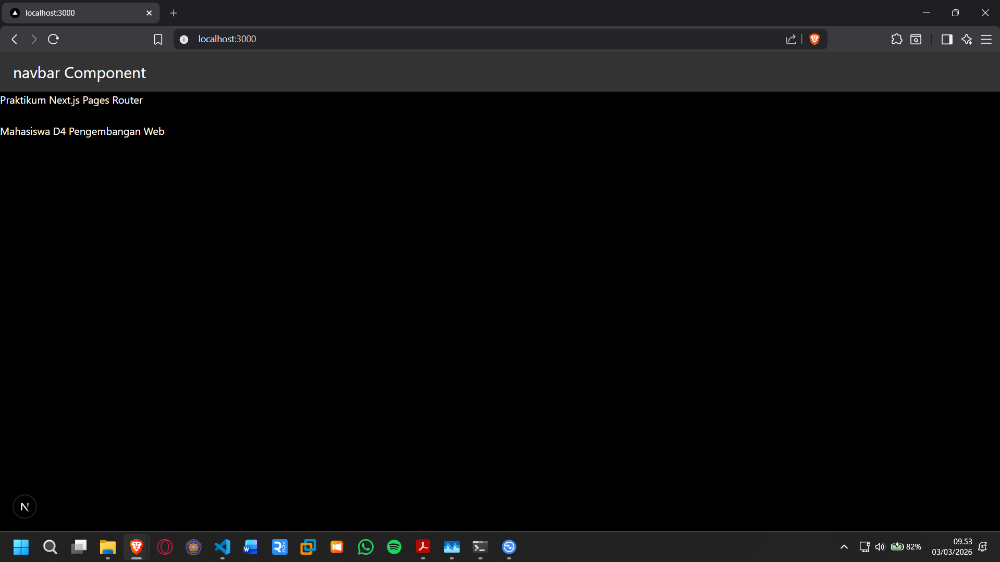
Catatan: Tidak ada error terkait tailwindcss

<b>Langkah 2 – Membuat Custom Document</b>

<li>Masuk ke folder: /src/pages/
<li> Modifikasi _document.js
<li> Isi dengan kode berikut:

```tsx
import { Html, Head, Main, NextScript } from "next/document";

export default function Document() {
  return (
    <Html lang="id">
      <Head />
      <body>
        <Main />
        <NextScript />
      </body>
    </Html>
  );
}
```

Periksa di Inspect Element bahwa atribut lang="id" sudah berubah.

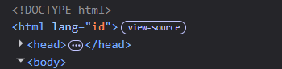

<b>Langkah 3 – Pengaturan Title per Halaman</b>

1. Buka pages/index.js.
2. Tambahkan:

```tsx
<head>
  <title>Praktikum Next.js Pages Router</title>
</head>
```

Refresh halaman dan perhatikan judul tab browser.
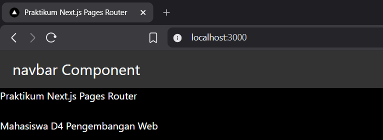

<b>Langkah 4 – Membuat Custom Error Page (404)</b>

<li>Di folder pages, buat file 404.tsx dengan isi kode:

```tsx
const Custom404 = () => {
  return (
    <div>
      <h1>404 - Halaman Tidak Ditemukan</h1>
      <p>Maaf, halaman yang Anda cari tidak ada.</p>
    </div>
  );
};

export default Custom404;
```

<li>Akses URL yang tidak ada, misalnya:

/dashboard

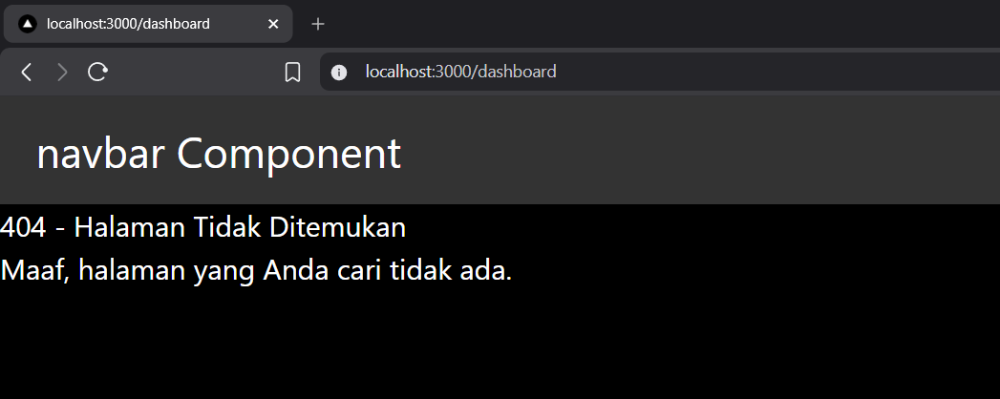

<b>Langkah 5 – Styling Halaman 404</b>

<li>Buat file: styles/404.module.scss

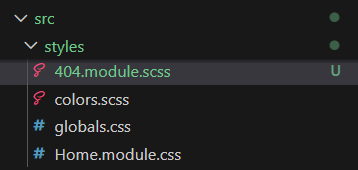

<li>Tambahkan style:

```scss
.error {
  width: 100vw;
  height: 100vh;
  display: flex;
  justify-content: center;
  align-items: center;
  flex-direction: column;

  &__image {
    width: 300px;
  }
}
```

<li>Modifikasi kode pada pages/404.tsx:

```tsx
import styles from "@/styles/404.module.scss";

const Custom404 = () => {
  return (
    <div className={styles.error}>
      <h1>404 - Halaman Tidak Ditemukan</h1>
      <p>Maaf, halaman yang Anda cari tidak ada.</p>
    </div>
  );
};

export default Custom404;
```

<li>Jalankan browser

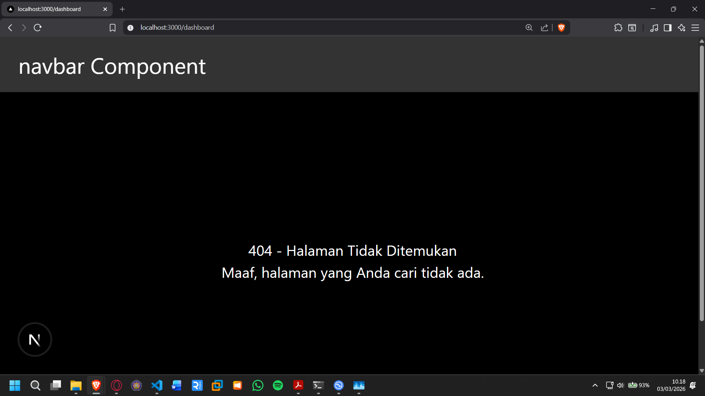

<li>Jika dijalankan masih ada navbarnya , untuk itu lakukan Handling Navbar di Halaman 404

Tambahkan ’/404’ pada disable navbar

```tsx
const disableNavbar = ["/auth/login", "/auth/register", "/404"];
```

<li>Jalankan browser

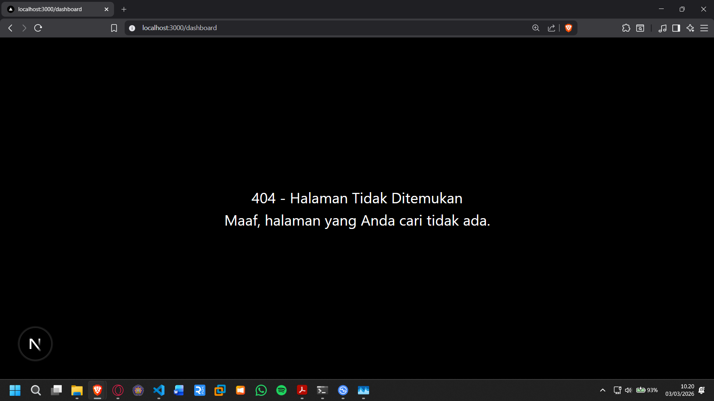

<b>Langkah 6 – Menampilkan Gambar dari Folder Public</b>

<li>Buka website https://undraw.co/ download png 404
<li>Cari 404 dan download png

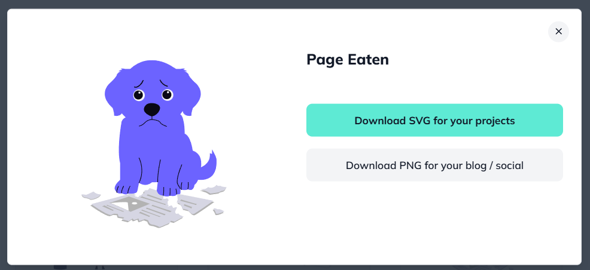

<li>Simpan gambar not-found.png ke folder public/ dan rename agar memudahkan

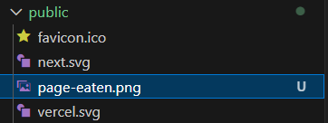

<li>Modifikasi kode pada 404.tsx:

```tsx

```

<li>Jalankan browser

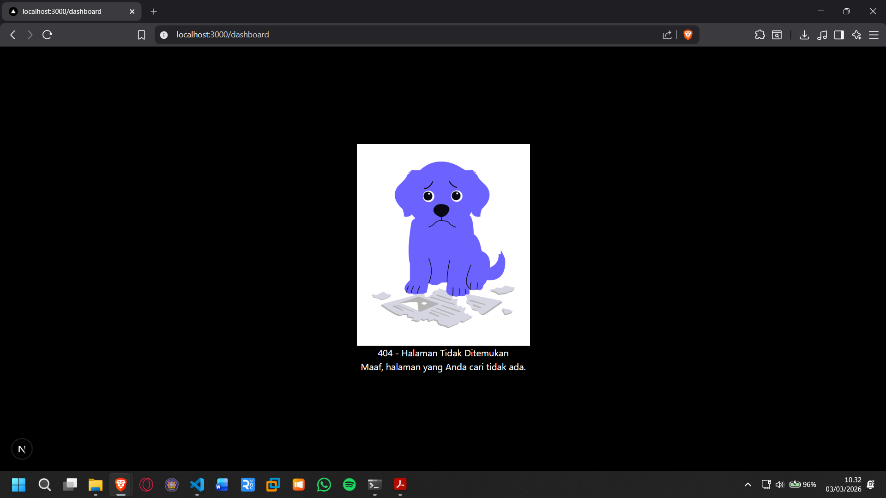

<b>Tugas 1 (Wajib)</b>

Tambahkan:

<li> Judul halaman
<li> Deskripsi singkat
<li> Gambar ilustrasi

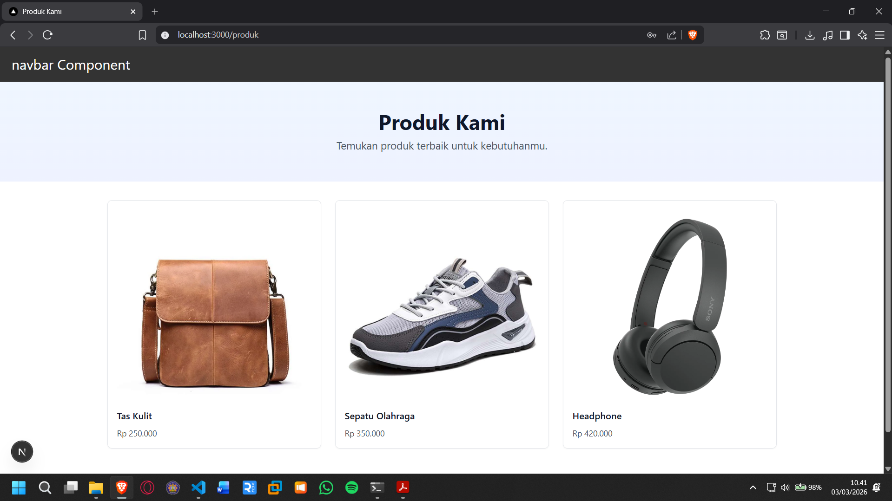

<b>Tugas 2 (Wajib)</b>

<li> Custom warna, font, dan layout halaman 404
<li> Navbar tidak tampil di halaman 404

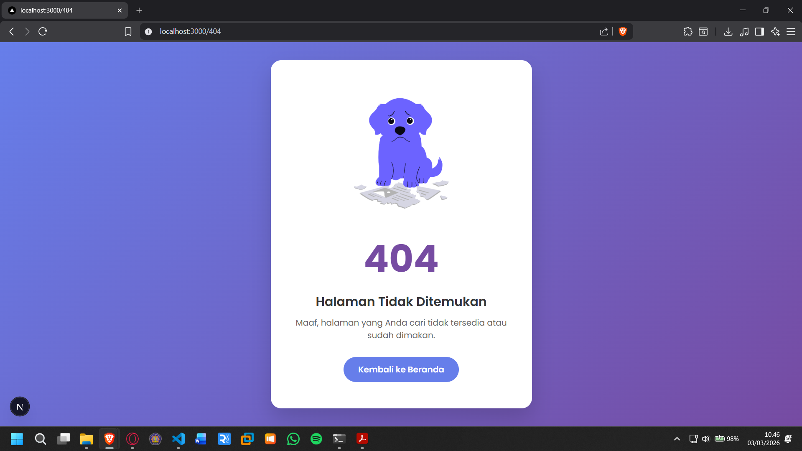

<b>Tugas 3 (Pengayaan)</b>

<li> Tambahkan tombol “Kembali ke Home”
<li> Gunakan navigasi Next.js (Link)

```tsx
import Link from "next/link";

<Link href="/" className={styles.button}>
  Kembali ke Beranda
</Link>;
```

<b>Pertanyaan Evaluasi</b>

1. **Apa fungsi utama \_document.js?**  
   File \_document.js digunakan untuk mengatur struktur dasar HTML pada aplikasi Next.js, seperti <html>, <head>, dan <body>. File ini hanya dirender di server dan digunakan untuk kebutuhan seperti custom font, meta dasar, atau atribut pada tag HTML. \_document.js tidak digunakan untuk logika interaktif atau state.

2. **Mengapa `<title>` tidak disarankan di \_document.js?**  
   Karena \_document.js hanya dirender sekali di server dan tidak berubah saat navigasi antar halaman. Jika `<title>` diletakkan di sana, judul halaman tidak akan dinamis. Untuk mengatur title per halaman, sebaiknya gunakan komponen Head dari Next.js.

3. **Apa perbedaan halaman biasa dan halaman 404.js?**  
   Halaman biasa dirender ketika route sesuai dengan file di folder pages atau app. Sedangkan 404.js adalah halaman khusus yang otomatis ditampilkan ketika route tidak ditemukan. File ini berfungsi sebagai custom error page untuk meningkatkan pengalaman pengguna.

4. **Mengapa folder public tidak perlu di-import?**  
   Folder public bersifat static assets dan dapat diakses langsung melalui root URL tanpa perlu di-import. File di dalamnya otomatis diserve oleh Next.js. Misalnya, file public/image.png dapat diakses melalui /image.png.
