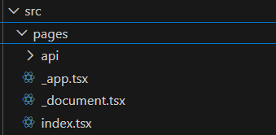
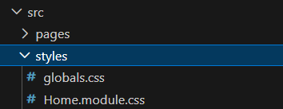
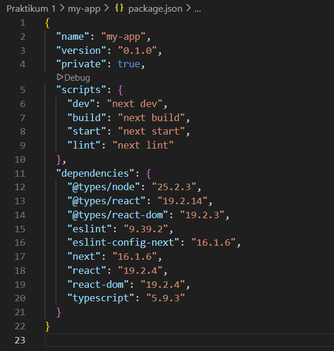
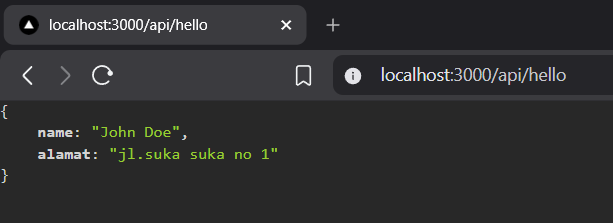
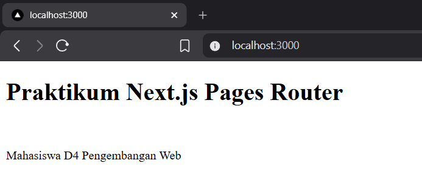
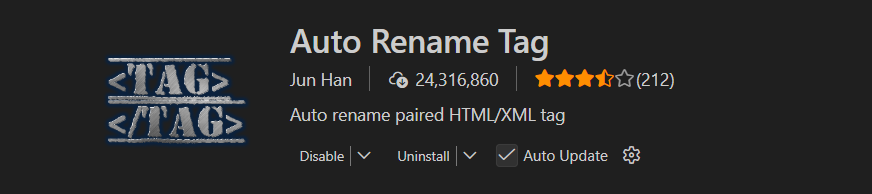
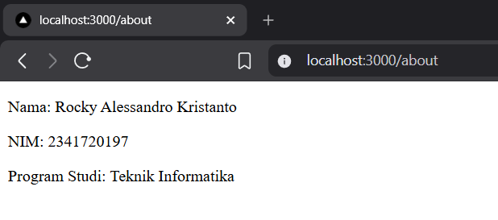

<b>Langkah 1 – Pengecekan Lingkungan</b>

1. Buka terminal / command prompt.
2. Jalankan perintah berikut:
3. node -v
4. npm -v
5. git -v


<b>Langkah 2 – Membuat Project Next.js</b>

1. Buat direktori baru dan masuk ke direktori kerja
   

2. Jalankan perintah:
   

3. Masuk ke folder projectnya
   

<b>Langkah 3 – Menjalankan Server Development</b>

1. Masuk ke folder project:
   

2. Jalankan aplikasi:
   

3. Buka browser dan akses: http://localhost:3000
   

<b>Langkah 4 – Mengenal Struktur Folder</b>

Amati folder utama:<br>
• pages/ → tempat routing halaman


• public/ → aset statis


• styles/ → file CSS<br>


• package.json → konfigurasi project


• gitIgnore -> file konfigurasi di Git yang berfungsi untuk memberitahu Git file atau folder apa saja yang TIDAK perlu di-track / di-commit ke repository.


<b>Langkah 5 – Modifikasi Halaman Utama</b></br>

1. Buka file: pages/index.js, Ubah isi halaman, misalnya:

```tsx
import Head from "next/head";
import Image from "next/image";
import { Inter } from "next/font/google";
import styles from "@/styles/Home.module.css";

const inter = Inter({ subsets: ["latin"] });

export default function Home() {
  return (
    <div>
      <h1>Praktikum Next.js Pages Router</h1> <br />
      <p>Mahasiswa D4 Pengembangan Web</p>
    </div>
  );
}
```

2. Simpan dan lihat perubahan di browser.
   

<b>Langkah 6 – Modifikasi API</b>

1. Buka folder api
   

2. Modifikasi hello.ts

```ts
// Next.js API route support: https://nextjs.org/docs/api-routes/introduction
import type { NextApiRequest, NextApiResponse } from "next";

type Data = {
  name: string;
  alamat: string;
};

export default function handler(
  req: NextApiRequest,
  res: NextApiResponse<Data>,
) {
  res.status(200).json({ name: "John Doe", alamat: "jl.suka suka no 1" });
}
```

3. Jalankan browser dengan Alamat http://localhost:3000/api/hello
   

Catatan: Pada saat screenshot di atas dilakukan, extension "JSON Formatter" sudah terinstall

<b>Langkah 7 – Modifikasi Background</b>

1. Buka file \_app.tsx
2. Modifikasi menjadi berikut

```tsx
// import '@/styles/globals.css'
import type { AppProps } from "next/app";

export default function App({ Component, pageProps }: AppProps) {
  return <Component {...pageProps} />;
}
```

3. Jalankan localhost
   

<b>Langkah 8 – Setup ext pada VSCode (opsional)</b>



<b>Tugas 1 (Wajib)</b><br>
• Buat halaman baru about.js di folder pages.<br>
• Tampilkan:<br>
o Nama Mahasiswa<br>
o NIM<br>
o Program Studi<br>

Code about.tsx:

```tsx
import Head from "next/head";
import Image from "next/image";
import { Inter } from "next/font/google";
import styles from "@/styles/Home.module.css";

const inter = Inter({ subsets: ["latin"] });

export default function Home() {
  return (
    <div>
      <p>Nama: Rocky Alessandro Kristanto</p>
      <p>NIM: 2341720197</p>
      <p>Program Studi: Teknik Informatika</p>
    </div>
  );
}
```

Output:

