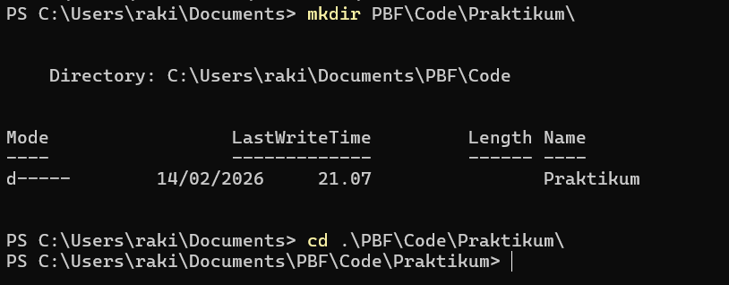
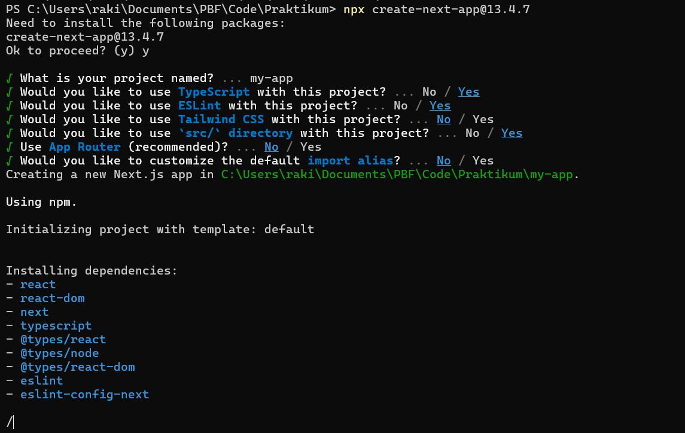
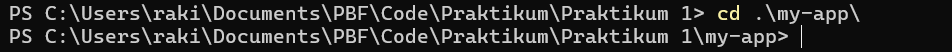
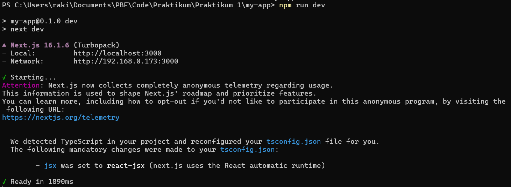
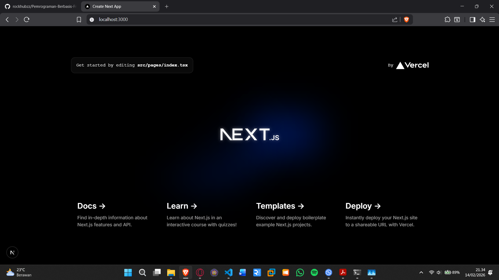

<b>Langkah 1 – Pengecekan Lingkungan</b>

1. Buka terminal / command prompt.
2. Jalankan perintah berikut:
3. node -v
4. npm -v
5. git -v

<b>Langkah 2 – Membuat Project Next.js</b>

1. Buat direktori baru dan masuk ke direktori kerja
   

2. Jalankan perintah:
   

3. Masuk ke folder projectnya
   

<b>Langkah 3 – Menjalankan Server Development</b>

1. Masuk ke folder project:
   

2. Jalankan aplikasi:
   

3. Buka browser dan akses: http://localhost:3000
   
